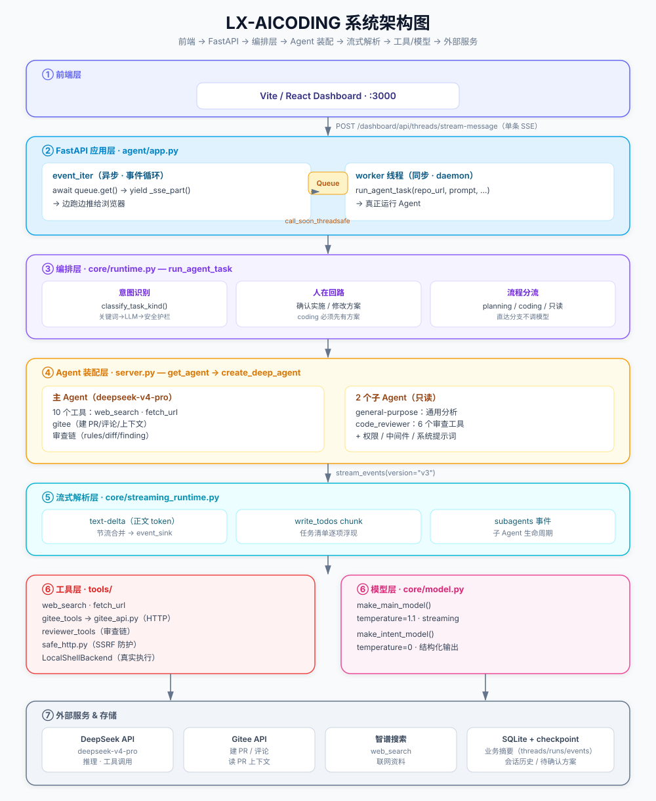
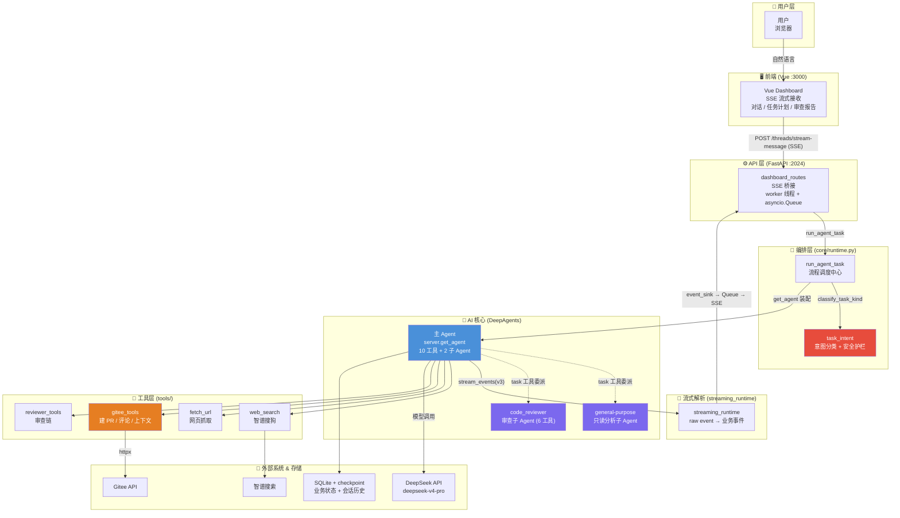
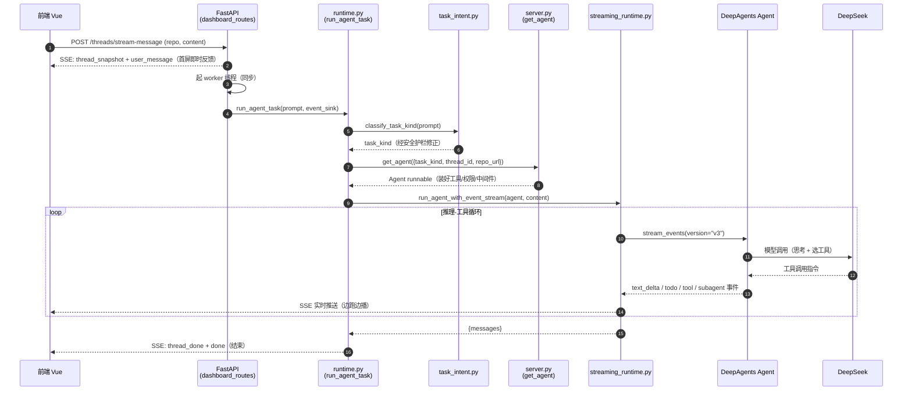
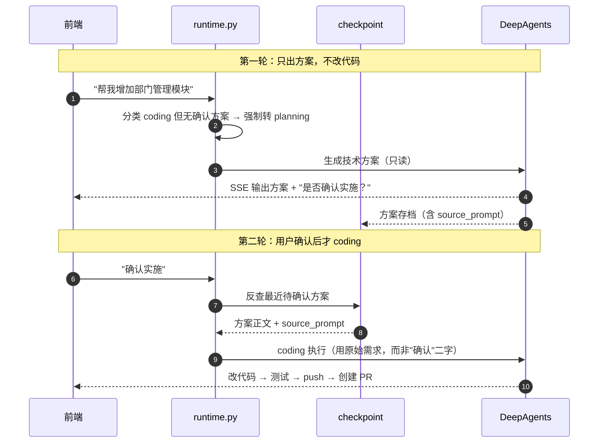

# LX-AICODING 系统架构图（ASCII 版）

> 一份「一眼看清全貌」的架构图，配合 `SYSTEM_ARCHITECTURE.md`（Mermaid 版，含 erDiagram / 时序图）一起看。
>
> 一句话架构：**前端 → FastAPI → 编排层决定「这轮跑什么」→ server.py 拼装 DeepAgents → 主/子 Agent 驱动 DeepSeek 调工具 → 流式事件回传前端 → 状态落 SQLite。**

## 彩色架构图（SVG）



> 若你的 Markdown 预览器不渲染 SVG，直接用浏览器打开 `ARCHITECTURE.svg` 查看。纯文本版见下文。

## 俯视图（模块关系总览）



## 请求时序图（Mermaid）

### 时序图 1：一次 coding 请求的完整调用链



### 时序图 2：先方案、后实施（人在回路）



---

## 纯文本版架构图

## 架构总览

```
┌─────────────────────────────────────────────────────────────────────────┐
│                        前端  (Vite/React  :3000)                        │
│              消费 SSE 事件流 · 展示对话/任务计划/审查报告               │
└───────────────────────────────┬─────────────────────────────────────────┘
                                │ POST /dashboard/api/threads/stream-message
                                │ (text/event-stream, 单条 SSE)
┌───────────────────────────────▼─────────────────────────────────────────┐
│                        FastAPI 应用层  (agent/app.py)                    │
│  /health (routes.py)   /dashboard/api/* (dashboard_routes.py)           │
│                                                                          │
│  _post_streaming_response()                                              │
│   ├─ event_iter (async·事件循环)                                        │
│   │      └─ await queue.get() → yield _sse_part() → 浏览器              │
│   ├─ asyncio.Queue  ◄── call_soon_threadsafe ──┐                        │
│   └─ worker 线程 (sync·daemon)                 │                        │
│          └─ run_agent_task() ──────────────────┘                        │
└───────────────────────────────┬─────────────────────────────────────────┘
                                │
┌───────────────────────────────▼─────────────────────────────────────────┐
│                       编排层  (core/runtime.py)                          │
│  run_agent_task —— 决定「本轮走哪条流程」                               │
│   ├─ 直达分支: workspace listing / git pull (不调模型)                  │
│   ├─ 意图识别: classify_task_kind (task_intent.py)                      │
│   │     └─ 关键词快查 → LLM 结构化分类 → 安全护栏                       │
│   ├─ 人在回路: 确认实施 / 修改方案 / coding 必须先有方案               │
│   └─ 分流: run_plan_response_task / 通用执行                            │
└───────────────────────────────┬─────────────────────────────────────────┘
                                │
┌───────────────────────────────▼─────────────────────────────────────────┐
│                     Agent 装配层  (server.py)                            │
│  get_agent() → create_deep_agent()                                      │
│   ├─ 主 Agent (deepseek-v4-pro)                                        │
│   │     ├─ 10 个工具 (web_search/fetch_url/gitee/审查链)               │
│   │     └─ 2 个子 Agent ──┬─ general-purpose (只读分析)                │
│   │                        └─ code_reviewer (6 个审查工具)              │
│   ├─ 系统提示词: get_system_prompt(task_kind)                           │
│   ├─ 权限: FilesystemPermission + LocalShellBackend                     │
│   └─ 中间件: context_injection / run_limits / tool_sanitize / ...       │
└───────────────────────────────┬─────────────────────────────────────────┘
                                │ stream_events(version="v3")
┌───────────────────────────────▼─────────────────────────────────────────┐
│                 流式解析层  (core/streaming_runtime.py)                  │
│  run_agent_with_event_stream → _consume_raw_event_stream                │
│   ├─ 解析 text-delta (正文 token) → 节流合并 → event_sink               │
│   ├─ 解析 write_todos chunk → 任务清单逐项浮现                          │
│   └─ 解析 subagents 事件 → 子 Agent 生命周期                            │
└──────────┬──────────────────────────────────────────────────────────────┘
           │
    ┌──────┴───────────────────────────────────────┐
    │                                               │
┌───▼───────────────┐                    ┌──────────▼──────────┐
│  工具层 (tools/)   │                    │   模型层 (model.py)  │
│ web_search         │                    │ make_main_model      │
│ fetch_url          │                    │ make_intent_model    │
│ gitee_tools        │                    └──────────┬──────────┘
│ reviewer_tools     │                               │
│  ├─ gitee_api.py   │                               │
│  └─ safe_http.py   │                               │
└───┬───────────┬────┘                               │
    │           │                                    │
    ▼           ▼                                    ▼
┌─────────┐ ┌─────────┐ ┌───────────────┐   ┌───────────────┐
│  Gitee  │ │ 智谱搜索 │ │ SQLite Store  │   │  DeepSeek API │
│   API   │ │ (web)   │ │ (业务摘要)    │   │ (deepseek-v4) │
└─────────┘ └─────────┘ └───────────────┘   └───────────────┘
                        ┌───────────────┐
                        │ LangGraph     │
                        │ checkpoint    │  ← 会话历史 / 待确认方案
                        └───────────────┘
```

---

## 关键数据流（一次用户请求）

```
前端 → POST SSE → worker 线程 → run_agent_task
  → 意图识别 → 人在回路判断 → get_agent 装配
  → stream_events(v3) 流式吐事件
  → streaming_runtime 解析 → event_sink → asyncio.Queue → SSE → 前端
```

---

## 分层职责速查

| 层 | 文件 | 职责 |
|---|---|---|
| 前端 | `ui/` (Vite) | 展示、SSE 消费 |
| API 层 | `app.py` + `api/` | 路由、SSE 桥接（asyncio.Queue + worker 线程） |
| 编排层 | `core/runtime.py` | 意图识别 + 人在回路 + 流程分流 |
| 装配层 | `server.py` | 建 Agent、配工具 / 子 Agent / 权限 / 中间件 |
| 流式层 | `core/streaming_runtime.py` | raw event → 业务事件 |
| 工具层 | `tools/` | 联网 / Gitee / 审查 |
| 模型层 | `core/model.py` | 主模型 + 意图模型（分开配置） |
| 存储层 | SQLite + checkpoint | 业务摘要 + 会话历史 |

---

## 三条贯穿全项目的关键设计

1. **人在回路**：`coding` 任务必须先有用户确认的方案，否则强制转 `planning`（`runtime.py:894`）。
2. **两条输出通道**：`record_event` 落 SQLite（持久化）+ `event_sink` 走 SSE（实时），同一套 id 规则。
3. **权限下沉**：工具列表不随 `task_kind` 变，只读约束在工具内部用 `runtime_is_read_only_task()` 拦截。

---

*配套：`SYSTEM_ARCHITECTURE.md`（Mermaid 版，含数据库 erDiagram 与请求时序图）、`AGENT_ENTRY.md`（入口）、`MAIN_AGENT_TOOLS.md`（工具）、`GITEE_API_LAYER.md`（Gitee HTTP 层）。*
