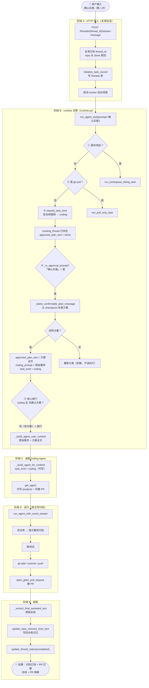
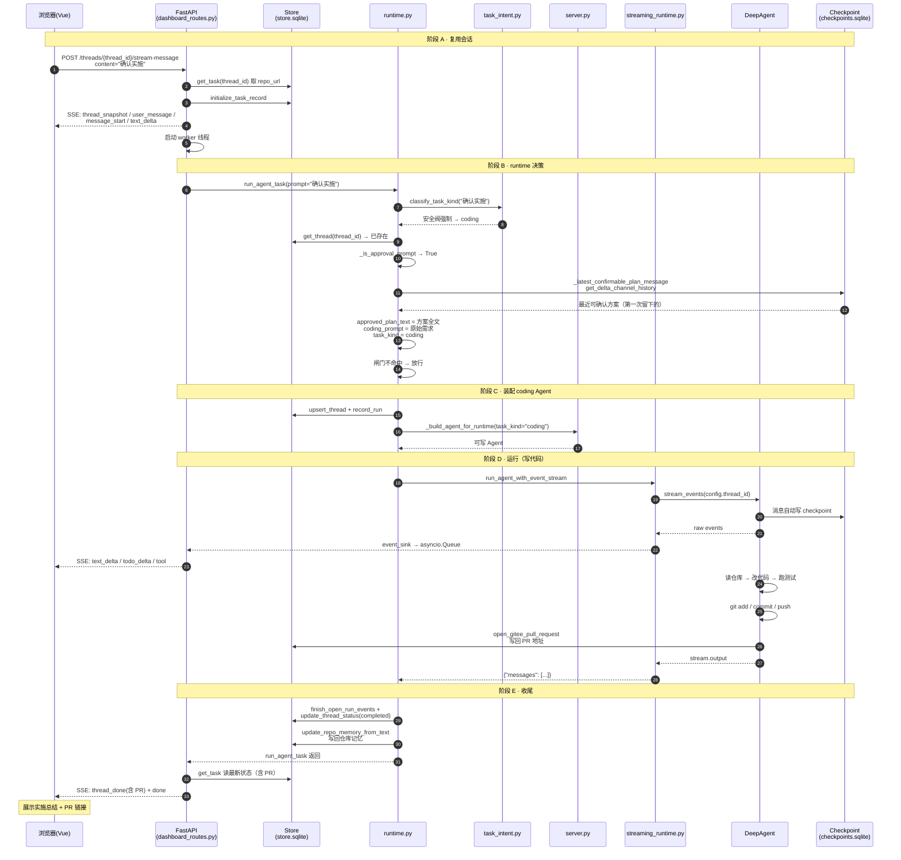

# 确认实施决策流程 —「确认实施」完整走查

> 本文档画第二次请求「确认实施」的**流程图 + 时序图**，讲清楚「从 checkpoint 反查方案 → 还原原始需求 → 真正写代码」的每一步。
>
> 核心结论：第二次和第一次的本质区别是 **`approved_plan_text` 从 None 变成方案全文**，闸门因此不命中，放行进 coding。
>
> 配套（第一次请求）：[REQUEST_DECISION_FLOW.md](./REQUEST_DECISION_FLOW.md) · [SECOND_REQUEST_FLOW.md](./SECOND_REQUEST_FLOW.md) · [REQUEST_FLOW_GUIDE.md](./REQUEST_FLOW_GUIDE.md)

---

## 1. 决策流程图（flowchart）

---

## 2. 时序图（sequenceDiagram）

---

## 3. 三个关键节点

| 节点 | 位置 | 意义 |
|---|---|---|
| **③ 安全阀强制 coding** | `task_intent.py:357` | 即使模型把"确认实施"判成 qa/planning，`_has_explicit_coding_marker` 命中，强制改回 coding |
| **④ 反查方案** | `runtime.py:858-871` | 从 checkpoint 找第一次的方案，还原 `approved_plan_text` + `coding_prompt`（原始需求） |
| **⑤ 闸门放行** | `runtime.py:894` | `approved_plan_text` 有值 → 不命中 → 进入 coding |

---

## 4. 第一次 vs 第二次（决策差异）

| 节点 | 第一次「帮我新增部门模型」 | 第二次「确认实施」 |
|---|---|---|
| 意图分类 | 模型判 coding | 安全阀**强制** coding |
| 分支① 确认 | 跳过 | **命中**，反查方案 |
| approved_plan_text | None | **方案全文** |
| coding_prompt | "帮我新增部门模型" | **还原成"帮我新增部门模型"** |
| 闸门 | **命中** → planning | **不命中** → 放行 |
| Agent 权限 | 只读 | **可写 /projects + 可建 PR** |
| 实际动作 | 输出方案 | **改代码 → 测试 → push → 建 PR** |
| 仓库记忆 | 一般不写 | **写回技术栈/结论/分支/PR** |

---

## 5. 一句话总结

> 第二次「确认实施」：安全阀强制 coding → 分支①从 checkpoint 反查方案 → `approved_plan_text` 有了值 → 闸门放行 → 走通用 coding 分支，Agent 拿着「原始需求 + 方案全文」真正改代码、提交、建 PR，最后把结论写进仓库记忆。

---

*本文档为 REQUEST_DECISION_FLOW.md 的「确认实施」互补版。*
