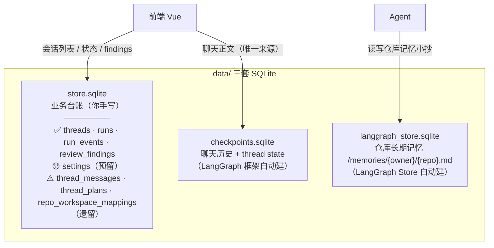
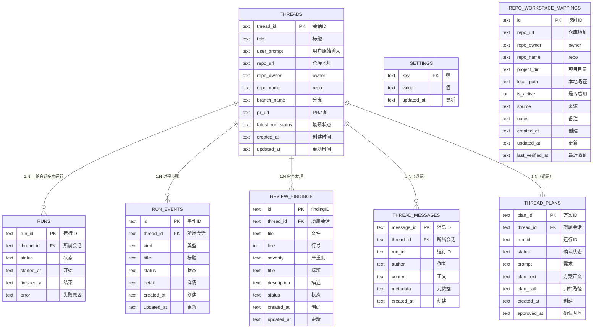

# DATABASE SCHEMA — LX-AICODING 数据库结构说明

> 本文档客观描述项目的数据库结构：三套 SQLite 各存什么、`store.sqlite` 里 8 张表各自的用途、字段、读写时机和使用状态。
>
> 依据源码：`agent/store/sqlite_store.py`（建表）、`agent/core/runtime.py`、`agent/api/dashboard_routes.py`（调用点）。

---

## 1. 三套数据库总览

| 数据库文件 | 谁定义表 | 存什么 |
|---|---|---|
| `store.sqlite` | **项目代码**（`sqlite_store.py`） | 业务台账：会话、运行、过程事件、审查发现 |
| `checkpoints.sqlite` | LangGraph 框架 | 完整聊天历史 + thread state |
| `langgraph_store.sqlite` | LangGraph Store | 仓库长期记忆 `/memories/{owner}/{repo}.md` |

> 三个 `.sqlite` 文件在 `data/` 目录，服务首次启动时 `CREATE TABLE IF NOT EXISTS` 生成；当前 `data/` 为空（项目尚未真正运行）。

---

## 2. store.sqlite 表结构（字段级）

> 注：`sqlite_store.py:53` 设了 `PRAGMA foreign_keys=OFF`，所以图中的 FK 关系只是**逻辑关联**，SQLite 层未开强外键校验；删除会话时由 `delete_thread` 手动清理各附属表。

---

## 3. 每张表：用途 + 读写时机 + 状态

### 图例

- ✅ 活跃：有运行时读写
- 🟡 预留：建表了但方法零调用
- ⚠️ 遗留：零调用，或仅被遗留模块调用

### ✅ 1. `threads` — 会话主表（核心）

- **用途**：一条记录 = 一个前端会话，存标题、仓库、分支、PR、最新状态。
- **写入**：
  - 前端 `POST /threads/stream-message` → `initialize_task_record` → `upsert_thread` 先登记；
  - 任务执行中 `upsert_thread` 更新标题/仓库；
  - 任务结束 `update_thread_status` 改状态、写回 `branch_name`/`pr_url`（PR 工具执行后）。
- **读取**：`dashboard_routes.py` 会话列表/详情；`runtime.py` 写记忆时读 `branch_name`/`pr_url`。

### ✅ 2. `runs` — 运行记录表

- **用途**：一个 thread 的每一轮运行记一条，含起止时间、状态、失败原因。
- **写入**：每轮开始 `record_run(status="running")`；结束 `record_run(status="completed/failed", finished=True, error=...)`。
- **读取**：`get_latest_run` 供详情页展示最近一次运行与失败原因（区分是模型/Git/Gitee/权限哪一环失败）。

### ✅ 3. `run_events` — 过程步骤事件表

- **用途**：记录 Agent 执行每一步（读文件、跑命令、建 PR、审查），供前端展示"正在做什么"。
- **写入**：全程。`runtime.py`/`streaming_runtime.py`/`tool_error` 中间件/工具内部经 `record_event` 写，先 `in_progress` 后 `completed/error`；每轮开始 `clear_run_events` 清空，结束 `finish_open_run_events` 收尾残留。
- **读取**：`list_run_events` 供详情页步骤区。**实时展示走 SSE，本表是持久化/兜底通道。**

### ✅ 4. `review_findings` — 审查发现表

- **用途**：`code_reviewer` 子 Agent 记录的结构化审查问题。
- **写入**：review 任务时 reviewer 调 `add_review_finding` 工具 → `add_finding`。
- **读取**：`list_findings` 供详情页展示 findings；`get_task` 附带返回。

### 🟡 5. `settings` — 键值配置表（预留）

- **用途**：存少量键值配置。
- **现状**：`set_setting`/`get_setting` **零运行时调用**，属于预留，未来可存全局开关。

### ⚠️ 6. `thread_messages` — 旧链路问答正文（遗留）

- **用途**：曾保存用户/助手对话正文。
- **现状**：**零调用**。新链路正文统一走 LangGraph **checkpoint**（`dashboard_routes.py` 明确"聊天正文只从 checkpoint 读"）。

### ⚠️ 7. `thread_plans` — 旧链路技术方案（遗留）

- **用途**：曾保存技术方案正文 + 确认状态（`pending/approved`）。
- **现状**：**零调用**。新链路方案也走 checkpoint，靠 `source_prompt` metadata 还原需求，不再落库。

### ⚠️ 8. `repo_workspace_mappings` — 旧链路仓库目录映射（遗留）

- **用途**：曾维护"Gitee 仓库 URL → 本地目录"映射。
- **现状**：仅被遗留模块 `agent/core/repo_mapping.py` 调（该模块已废弃）。新链路改为「从 URL 解析固定推导 `projects/<repo>`」，不再查映射表。

---

## 4. 一句话总结

> 业务库 `store.sqlite` 共 8 张表，其中**只有 `threads` / `runs` / `run_events` / `review_findings` 4 张在跑**；`settings` 是预留；`thread_messages` / `thread_plans` / `repo_workspace_mappings` 3 张是旧链路遗留（聊天正文与技术方案已迁移到 checkpoint）。
