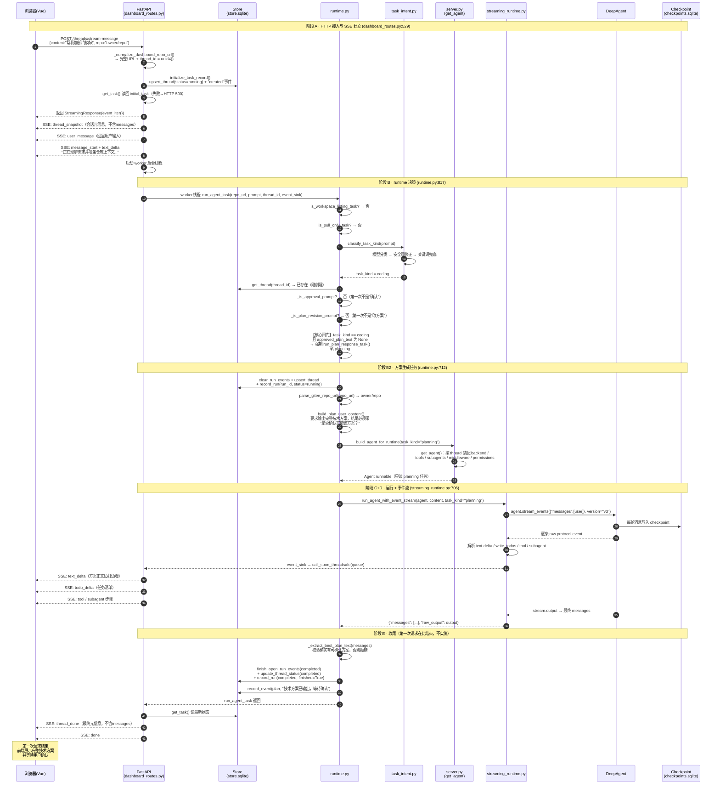

# 用户第一次请求的完整时序图

> 本文档专门画「**用户第一次请求**」从头到尾的完整时序图。
> 第一次请求的定义：**新会话**（首次进入页面，没有 thread_id / 历史 / 待确认方案），
> 用户输入的是开发实现类需求（如"帮我加一个部门管理模块"）。
>
> **核心结论先放这**：第一次请求 **不会进入 coding 实施**。因为按"先方案、后实施"的产品流程，
> 只要没有已确认的技术方案，`task_kind == coding` 的需求会被 runtime 的核心闸门**强制转成 planning**，
> 只输出一份技术方案并等待用户确认，方案输出完成后本轮即结束。

---

## 场景前提

| 项 | 值 |
|---|---|
| 会话 | 全新，`thread_id = uuid4()` 刚生成 |
| 用户输入 | `"帮我给这个项目增加一个部门管理模块"` |
| 仓库 | `msb-goldbin/ai_coding` |
| 历史/待确认方案 | 无 |
| 意图分类 | 模型判为 `coding` |
| 实际走向 | **核心闸门 → planning（方案生成）** |

---

## 完整时序图（一次请求，从头到尾）

> 图里把整条链路按阶段标注了 Note。`autonumber` 可对照编号看每一步。

---

## 这张图的关键点

1. **第一次请求永远到不了 coding**。从 `runtime.py:894` 的核心闸门看：`task_kind == coding` 但没有 `approved_plan_text` → 直接转 `run_plan_response_task`。这是"先方案、后实施"的**确定性产品流程**，不是提示词软约束。

2. **强制 planning 的三重保障**（层层叠加）：
   - `task_kind` 是模型分类的结果（第一层）；
   - 即便模型判成 coding，runtime 闸门也会改判（第二层）；
   - `_build_plan_user_content` 里明确要求"不要修改文件、不要提交、不要 push、不要创建 PR"（第三层，`runtime.py:270`）。

3. **方案在哪里？** 方案正文由 DeepAgent 写入 **checkpoint**（`A->>C`），不落 `thread_plans` 表、不存 Markdown 文件。前端通过 SSE 实时看到，刷新后从 checkpoint 恢复。

4. **第二次请求怎么衔接**（用户说"确认实施"时）：
   - `_is_approval_prompt("确认实施")` → True
   - 从 checkpoint 反查最近方案，取 `source_prompt`（= 第一次请求的原始需求）→ `task_kind = "coding"`
   - 把方案全文作为 `approved_plan` 注入 → Agent 才真正开始改代码、提交、建 PR
   - 完整衔接逻辑见 [REQUEST_FLOW.md](./REQUEST_FLOW.md) 阶段 B。

---

## 第一次请求 vs 后续"确认实施"请求（对照）

| 环节 | 第一次请求 | 后续"确认实施" |
|---|---|---|
| thread_id | 新生成 | 复用现有 |
| 意图分类 | 模型判 coding | 直接按"确认"命中 |
| 走向 | 闸门 → planning | checkpoint 反查方案 → coding |
| Agent 任务 | 只读，输出方案 | 改代码/测试/提交/建 PR |
| 仓库记忆 | 方案一般不写记忆 | 任务后写回 `/memories/` |
| 结束状态 | `awaiting`（等确认） | `completed`（含 PR） |

---

*本文档为 REQUEST_FLOW.md 的"第一次请求"专题版，用于单独讲解新会话首轮的完整链路。*
