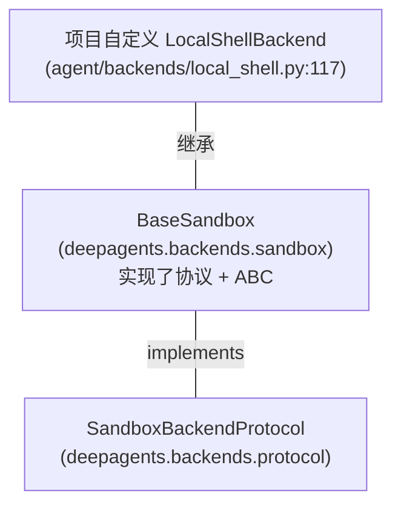
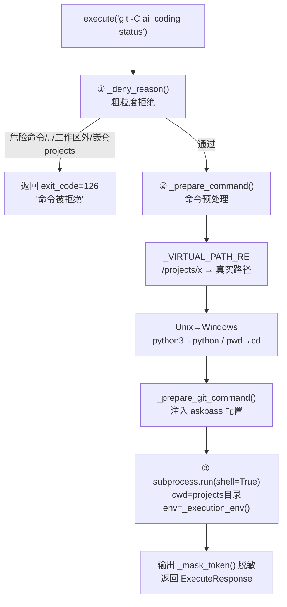
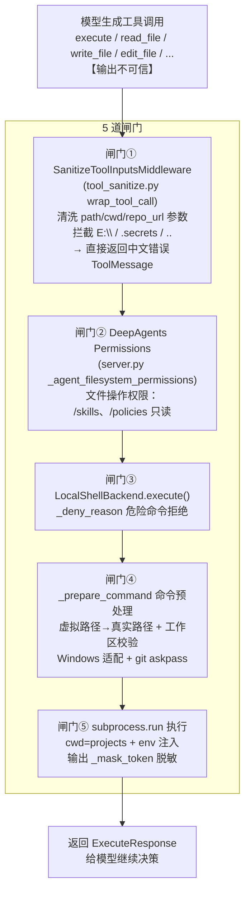

# LocalShellBackend 深度理解

> 本文档讲透项目自定义的 `agent/backends/local_shell.py`——它是 **Agent 与真实电脑之间的工程边界**：
> Prompt 告诉模型"应该怎么做"，LocalShellBackend 决定模型"最终能不能读、写、执行"。
>
> 核心代码：`agent/backends/local_shell.py` · `agent/backends/workspace.py` · `agent/backends/permissions.py`
> 装配位置：`agent/server.py:363`（get_agent）· `agent/server.py:88`（ensure_backend_for_thread）

---

## 目录

- [一、一句话定位](#一一句话定位)
- [二、三个角色](#二三个角色)
- [三、继承关系](#三继承关系)
- [四、方法清单（39 个）](#四方法清单39-个)
- [五、核心执行链路详解](#五核心执行链路详解)
- [六、模型的一条命令要过几道闸门](#六模型的一条命令要过几道闸门)
- [七、记忆锚点](#七记忆锚点)

---

## 一、一句话定位

> **LocalShellBackend 是"模型能不能动真电脑"的最终闸门。** 它不是官方那个"裸执行"的 `LocalShellBackend`，而是在 `BaseSandbox` 基类上，把每个文件/命令方法都用自己的一套**安全边界 + Windows 适配 + Gitee 认证**重写了一遍的**受控本地执行层**。

---

## 二、三个角色

这个类同时扮演三个身份，理解它就理解了这个类：

| 角色 | 干什么 | 对应代码 |
|---|---|---|
| **① 协议实现者** | 实现 DeepAgents 文件/命令协议，让框架认它是合法 backend | `execute/ls/read/write/edit/glob/grep/upload/download`（`:203-434`） |
| **② 安全闸门** | 命令白名单/拒绝名单、工作区路径边界、只读目录保护、token 脱敏 | `_deny_reason` / `_resolve_virtual_path` / `_write_deny_reason` / `_mask_token` |
| **③ Windows/Gitee 适配器** | Unix 命令转 Windows、虚拟路径映射、Git askpass 非交互认证 | `_prepare_command` / `_prepare_git_command` / `_execution_env` |

---

## 三、继承关系



**关键点**：它继承 `deepagents.backends.sandbox.BaseSandbox`（不是官方的 `LocalShellBackend`），但**只借"接口契约"，几乎全部重写实现**：

- `BaseSandbox` 的默认实现是"Unix shell 驱动"（`python3 -c ...`、`grep`、`rm -rf`），Windows 跑不通；
- 项目需要**虚拟路径映射**（`/projects/...` ↔ 真实路径）和**安全边界**，必须自己实现。

`BaseSandbox` 要求子类必须实现的抽象方法（项目全部实现）：

| 抽象方法 | 实现位置 |
|---|---|
| `execute()` | `:203` |
| `upload_files()` | `:397` |
| `download_files()` | `:418` |
| `id`（属性） | `:168` |

---

## 四、方法清单（39 个）

### ① DeepAgents 协议方法（框架调用）

| 方法 | 行号 | 作用 |
|---|---|---|
| `id`（属性） | `:168` | backend 唯一标识 `local-windows:{root}` |
| `get_work_dir()` | `:172` | 返回默认工作目录虚拟路径 `/projects` |
| `get_workspace_root()` | `:176` | 返回虚拟根 `/` |
| `health()` | `:180` | 健康检查（目录/venv/git/python/node） |
| `execute(command, *, timeout)` | `:203` | **命令执行**——三层防护 + Windows 适配 + token 脱敏 |
| `ls(path)` | `:256` | 列目录 |
| `read(file_path, offset=0, limit=2000)` | `:278` | 读文件（UTF-8，回退 Latin-1） |
| `write(file_path, content)` | `:314` | 新建文件（已存在报错） |
| `edit(file_path, old, new, replace_all)` | `:329` | 文本替换（find & replace） |
| `glob(pattern, path=None)` | `:358` | 递归搜索文件名 |
| `grep(pattern, path=None, glob=None)` | `:378` | 搜索文件内容 |
| `upload_files(files)` | `:397` | 批量上传 |
| `download_files(paths)` | `:418` | 批量下载 |

### ② 旧兼容接口（给历史工具迁移）

| 方法 | 行号 | 作用 |
|---|---|---|
| `read_file(path)` | `:440` | 旧工具读文件 |
| `write_file(path, content)` | `:449` | 旧工具写文件（可新建可覆盖） |
| `list_files(path=".")` | `:462` | 旧工具列目录 |
| `run(command, cwd=".", timeout=300)` | `:472` | 旧工具执行命令，返回 `CommandResult` |

> 官方没有这套。`execute()` 返回 `ExecuteResponse`，`run()` 返回 `CommandResult`——两层并存是为了历史工具逐步迁移（`:472-480`）。

### ③ 初始化（自动建工作区）

| 方法 | 行号 | 作用 |
|---|---|---|
| `_ensure_layout()` | `:513` | 创建全部子目录 + 标记文件 |
| `_ensure_policy_files()` | `:561` | 生成 workspace.md / git.md / security.md |
| `_ensure_shared_python_venv()` | `:581` | 创建共享 Python venv |
| `_ensure_gitee_askpass_files()` | `:608` | 生成 Git askpass 脚本 |

### ④ 路径处理（安全核心）

| 方法 | 行号 | 作用 |
|---|---|---|
| `_normalize_compat_path(path)` | `:644` | 旧工具路径统一成虚拟路径 |
| `_resolve_virtual_path(path)` | `:657` | **虚拟路径 → 真实路径，强制在工作区内** |
| `_to_virtual_path(path)` | `:676` | 真实路径 → 虚拟路径（不暴露本机路径） |
| `_is_under_root(path)` | `:688` | 是否在工作区根下 |
| `_is_under(path, parent)` | `:696` | 是否在某个子目录下 |

### ⑤ 安全控制

| 方法 | 行号 | 作用 |
|---|---|---|
| `_write_deny_reason(path)` | `:706` | 写保护：skills/policies/runtimes/logs/.secrets 只读 |
| `_is_writable(path)` | `:725` | 探测可写性 |
| `_deny_reason(command)` | `:735` | 命令拒绝：危险模式/`..`/工作区外绝对路径/嵌套 projects |

### ⑥ 命令预处理

| 方法 | 行号 | 作用 |
|---|---|---|
| `_prepare_command(command, *, cwd_path)` | `:761` | 总入口：路径替换 + Unix→Windows |
| `_normalize_command_for_projects_cwd(command)` | `:781` | 修掉 `projects/projects/<repo>` 重复路径 |
| `_prepare_git_command(command)` | `:801` | git 命令注入 askpass |
| `_prepare_run_command(command, cwd)` | `:819` | `run()` 专用：解析 cwd + 兼容 `cd x && git...` |
| `_virtual_command_path_replacement(match)` | `:845` | 命令里的 `/projects/...` 替换成真实路径 |
| `_execution_env()` | `:867` | 构造子进程环境：venv + 禁弹窗 + GIT_ASKPASS |

### ⑦ 模块级单例/工厂

| 函数 | 行号 | 作用 |
|---|---|---|
| `get_local_shell_backend()` | `:896` | 全局单例 |
| `create_local_shell_backend(...)` | `:904` | DeepAgents 工厂函数 |
| `validate_local_shell_startup_config()` | `:909` | 启动时验证 |

---

## 五、核心执行链路详解

### 1. execute()：命令执行的三层防护

模型说 `git -C ai_coding status`，落地前经过：



`git -C ai_coding status` 会被改写成：

```
git -c credential.helper= -c core.askPass="E:\ai_workspace\.secrets\gitee_askpass.cmd" -C ai_coding status
```

**目的**：临时覆盖 Git 凭据配置，不弹窗、不污染用户全局配置。token 只存在于环境变量里，命令字符串/日志里永远没有。

`run()` 兼容接口（`:472`）还有**第二层白名单** `normalize_safe_command()`（`permissions.py:58`）：只允许 `python/py/pytest/pip/git/dir/type/ruff` 8 个命令族，拦截 `&&`、`|`、`;`、`>`、`$( )` 等 shell 操作符和 `rm -rf`、`reg delete` 等危险片段。

### 2. 文件操作：路径解析是安全总入口

`read("/projects/ai_coding/README.md")`：

```
read()
  → _resolve_virtual_path()   # :657 关键！
       ├─ 虚拟路径 /projects/... 拼到 root → E:\ai_workspace\projects\ai_coding\README.md
       └─ _is_under_root() 校验 → 越界抛 PermissionError
  → 读 bytes → UTF-8 解码，失败回退 Latin-1
  → 返回 ReadResult
```

堵死的逃逸路径：
- `../etc/passwd` → 拼到 root 外 → 抛错
- `D:\secrets.txt`（盘符绝对路径）→ 不落在 root 内 → 抛错

写操作再叠加 `_write_deny_reason`（`:706`）：即使在工作区内，`/skills`、`/policies`、`/runtimes`、`/logs`、`.secrets` 也拒绝——**防止模型自己改掉规则/工具/敏感文件**。

### 3. 初始化即建家

`__init__` → `_ensure_layout()`（`:513`）自动创建整个工作区目录树 + 规则文件 + askpass 脚本 + `.ai_coding_workspace.json`。**Agent 第一次启动就具备稳定的文件系统语义**，不依赖人工建目录。

---

## 六、模型的一条命令要过几道闸门

把 `LocalShellBackend` 放到整个链路里，一条命令从模型发出到落地，共 **5 道闸门**（前 2 道在 DeepAgents 层，后 3 道在 LocalShellBackend 内部）：



**各闸门的分工哲学**：

| 闸门 | 类型 | 作用 | 失败时的反馈 |
|---|---|---|---|
| ① 工具入参清洗 | 前置友好层 | 提前把 `E:\`、`.secrets`、`..` 转成模型能理解的中文错误，**减少无效重试** | 中文 ToolMessage（可恢复） |
| ② DeepAgents Permissions | 框架权限层 | 文件操作按 `FilesystemPermission` 判定（`/skills` 只读等） | 框架拒绝 |
| ③ 危险命令拒绝 | 后端硬闸 | 粗粒度拦截危险命令/穿越/越界 | exit_code=126 |
| ④ 命令预处理 | 后端硬闸 | 路径转换 + 工作区校验 + Windows/Git 适配 | PermissionError |
| ⑤ 执行 + 脱敏 | 后端执行 | 真实执行 + token 脱敏 | ExecuteResponse |

> **设计原则**：前 2 道闸门负责"让模型更快改对"（友好、可恢复），后 3 道闸门负责"兜底绝对安全"（确定、不可绕过）。**模型可以骗过 ①② 让它多试几次，但永远绕不过 ③④⑤。**

另外还有一层**整体运行保护**（不在单条命令上，而是整轮 Agent 上）：
- `ModelCallLimitMiddleware`（模型调用上限 5000 次，`server.py:66`）
- `AgentRunLimitTracker`（`streaming_runtime.py:548`，工具调用次数/时长）
- `ToolErrorMiddleware`（工具错误恢复，`server.py:454`）

以及**非安全类的两个 middleware**：`ContextInjectionMiddleware`（每轮开始注入仓库记忆）、`MessageSanitizeMiddleware`（发给模型的 message 清洗，处理 `invalid_tool_calls`）。

---

## 七、记忆锚点

> **LocalShellBackend = 协议实现者 + 安全闸门 + Windows/Gitee 适配器。**
> 一条命令从模型到落地共 5 道闸门，前 2 道让人改对，后 3 道兜底绝对安全；
> 一切的路径都过 `_resolve_virtual_path`，一切的 token 都过 `_mask_token`，
> "能不能碰真实系统"永远由确定性代码决定，不赌模型。

---

*本文档由分析项目代码整理，用于深入理解自定义 LocalShellBackend 的设计与安全边界。*
