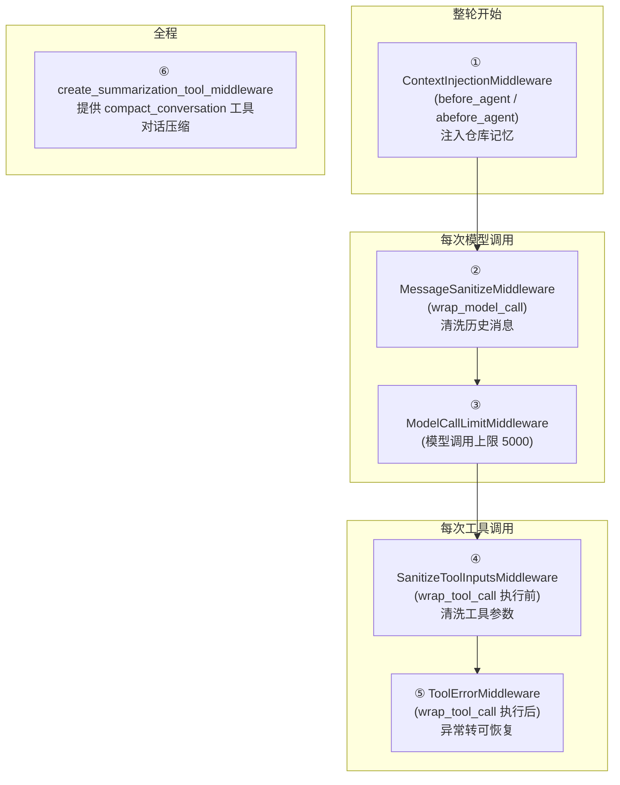

# Agent 中间件详解

> 本文档讲透项目里的中间件体系：**6 个挂载在 Agent 上**（4 个自写 + 2 个官方）、**1 个非中间件的运行保护**（run_limits）、**2 个死代码**。
> 中间件是"包在 Agent 运行链路外面的钩子"，在整轮开始 / 每次模型调用 / 每次工具调用时插一脚，做清洗、注入、限流、兜底。
>
> 核心代码：`agent/core/middleware/` · 挂载位置：`agent/server.py:448`

---

## 目录

- [一、一句话定位](#一一句话定位)
- [二、挂载位置：6 个中间件在生命周期哪里插一脚](#二挂载位置6-个中间件在生命周期哪里插一脚)
- [三、6 个中间件清单](#三6-个中间件清单)
- [四、项目自写 4 个（深入）](#四项目自写-4-个深入)
- [五、官方 2 个](#五官方-2-个)
- [六、run_limits.py —— 不是中间件的运行保护](#六run_limitspy--不是中间件的运行保护)
- [七、死代码 2 个](#七死代码-2-个)
- [八、记忆锚点](#八记忆锚点)

---

## 一、一句话定位

> **中间件 = 包在 Agent 运行链路外面的"钩子"。** 模型不可信，所以每个关键环节都插一道钩子：整轮开始前注入仓库记忆、模型调用前清洗历史消息、工具调用前清洗参数、工具调用后兜底异常、全程限流防失控。

挂载代码（`server.py:448-455`）：

```python
middleware=[
    ContextInjectionMiddleware(),                      # ① 注入记忆
    MessageSanitizeMiddleware(),                      # ② 清洗消息
    SanitizeToolInputsMiddleware(backend=backend),    # ④ 清洗参数
    create_summarization_tool_middleware(main_model, agent_backend),  # ⑥ 压缩上下文
    ModelCallLimitMiddleware(run_limit=5000, exit_behavior="end"),    # ③ 限调用
    ToolErrorMiddleware(backend=backend),             # ⑤ 兜底异常
],
```

---

## 二、挂载位置：6 个中间件在生命周期哪里插一脚



`before_agent` 整轮只触发一次；`wrap_model_call` 每调一次模型触发一次；`wrap_tool_call` 每调一次工具触发一次。

---

## 三、6 个中间件清单

| # | 中间件 | 自写/官方 | 钩子位置 | 干什么 |
|---|---|---|---|---|
| ① | `ContextInjectionMiddleware` | 🟢 自写 | `before_agent` | 仓库记忆注入为 SystemMessage，避免模型从零理解仓库 |
| ② | `MessageSanitizeMiddleware` | 🟢 自写 | `wrap_model_call` | 清理历史里 DeepSeek 不认的 content block，防 400 |
| ③ | `ModelCallLimitMiddleware` | 🔵 LangChain | 模型调用链 | 模型调用次数上限 5000，防死循环烧钱 |
| ④ | `SanitizeToolInputsMiddleware` | 🟢 自写 | `wrap_tool_call` 前 | 清洗 path/cwd/repo_url，拦 `E:\` / `.secrets` / `..` |
| ⑤ | `ToolErrorMiddleware` | 🟢 自写 | `wrap_tool_call` 后 | 工具异常转 `status="error"` 的 ToolMessage，模型可自行修正 |
| ⑥ | `create_summarization_tool_middleware` | 🔵 DeepAgents | 全程 | 提供 `compact_conversation` 工具压缩上下文 |

---

## 四、项目自写 4 个（深入）

### ① ContextInjectionMiddleware（`context_injection.py`）

**问题**：仓库长期记忆存在 LangGraph Store，但如果只靠模型主动去读，模型会忘记读、或先浪费一堆工具调用扫描仓库。

**做法**：整轮开始前（`before_agent`），把仓库标识 + 记忆文件路径 + 已有记忆内容注入为一条 **SystemMessage** 放在消息列表最前面。

**关键点**：
- 只注入一次（`before_agent`），避免每次模型调用都加 token 成本（`context_injection.py:114`）。
- 记忆截断到 6000 字符（`MAX_REPO_MEMORY_CHARS`，`:37`）。
- **注入的是"长期上下文参考"，不是权限边界**——记忆和真实仓库冲突时，模型必须听真实文件（`:78-79`）。
- 无 repo_url 的任务不注入（问答类不制造错误背景）。

### ② MessageSanitizeMiddleware（`message_sanitize.py`）

**问题**：DeepAgents 从 checkpoint 恢复历史消息时，可能带上 `invalid_tool_calls`、`tool_call_chunk` 等 LangChain 内部块。DeepSeek 兼容接口不认识它们，报错：

```
messages[301]: unknown variant `invalid_tool_call`, expected `text`
```

**做法**：每次模型调用前（`wrap_model_call`），清洗发出去的消息副本：
- `invalid_tool_calls` 一律移除；
- 合法的 `tool_calls` 保留（否则后面的 ToolMessage 变成"孤立工具消息"触发 400）；
- **跨消息配对**：`AIMessage(tool_calls=[id=A])` 后面必须跟着 `ToolMessage(tool_call_id=A)`，不完整的整组移除（`sanitize_messages_for_model`，`:274`）。

**设计边界**（`:21-27`）：不改用户消息、不写 checkpoint、只清洗"这一次模型请求"的副本。

### ④ SanitizeToolInputsMiddleware（`tool_sanitize.py`）

**问题**：模型生成工具参数时常见的坑——传 `E:\` 绝对路径、用 `..` 越权、碰 `.secrets`、URL 带 token。

**做法**：每次工具执行前（`wrap_tool_call`）清洗参数：
- 路径参数（`PATH_ARGUMENTS`）→ 工作区内相对路径，越界直接拒绝（`ToolInputRejected`）；
- Gitee URL → 规范化、去掉 token；
- `offset/limit` → 字符串强制转整数（`_coerce_int`）。

**关键点**：
- 拒绝时返回中文 `ToolMessage`（`error + hint + workspace`），模型能读懂并修正（`:51-65`）；
- 它是 DeepAgents 工具调用生命周期里的钩子，**同时覆盖自定义 Gitee 工具和 DeepAgents 原生文件/命令工具**（`:222-224`）；
- **它是前置预防，不是最终边界**——真正兜底是 LocalShellBackend（见 `LOCAL_SHELL_BACKEND.md`）。

### ⑤ ToolErrorMiddleware（`tool_error.py`）

**问题**：LangGraph 默认行为——工具抛异常 → 整轮任务 fail → 前端只显示"任务失败"，模型和用户都不知道原因。

**做法**：工具执行后（`wrap_tool_call`）捕获所有异常，转成 `status="error"` 的 ToolMessage，content 里带：
`error_type`（异常类名）+ `error`（脱敏文本）+ `hint`（中文建议）+ `workspace`（工作区路径）。

**异常分类**（`tool_error.py:69-75`）：
- `WorkspacePermissionError` → 提示改用工作区内虚拟路径
- `IsADirectoryError` → 提示先 ls
- `FileNotFoundError` → 路径拼错或文件被删
- `TimeoutError` → 超时
- 其他 → 兜底建议先查目录再重试

**配合关系**（`:23-26`）：**④ 是前置预防（减少可预防异常），⑤ 是兜底防线（处理没被挡住的运行时异常）**。④ 拦不住的真异常，⑤ 接住并让模型自主恢复。

---

## 五、官方 2 个

### ③ ModelCallLimitMiddleware（LangChain 提供）

模型调用次数上限（`run_limit=5000, exit_behavior="end"`，`server.py:66`）。防止模型在工具失败、上下文异常时无限循环。

### ⑥ create_summarization_tool_middleware（DeepAgents 提供）

给 Agent 一个 `compact_conversation` 工具，用于刷新上下文窗口、压缩膨胀，减少 token 成本。

---

## 六、run_limits.py —— 不是中间件的运行保护

它**不是 middleware 类**，而是被 `streaming_runtime.py:548` 使用的运行保护工具：

| 类 | 作用 |
|---|---|
| `AgentRunLimits` | 按任务类型读阈值（`run_limits.py:20`）：qa 60 次/600s，coding 300 次/1800s |
| `AgentRunLimitTracker` | 逐事件计数（`observe_event`），超限抛 `AgentRunLimitExceeded` |
| `AgentRunLimitExceeded` | 异常，被 `run_agent_with_event_stream` 捕获后把 thread 标 failed |

**和 ③ ModelCallLimitMiddleware 是"双保险"**：

| | 管什么 | 在哪计数 |
|---|---|---|
| ③ ModelCallLimitMiddleware | 模型调用次数 | 模型调用链 |
| run_limits 的 Tracker | **工具调用次数 + 总时长** | 事件流（`_consume_raw_event_stream`） |

**为什么不能只用模型调用次数**：`run_limits.py:52` 注释提醒——不要用 raw event 的 message-start 数模型调用（流式片段/子 Agent/中间 assistant 消息都会产生它，容易误判）。所以用"时间 + 工具次数"更可靠，还能覆盖"模型不再调工具但整体卡很久"的情况。

---

## 七、死代码 2 个

| 文件 | 状态 |
|---|---|
| `memory_update.py` | 未接线（真实写记忆逻辑在 `runtime.py:963`，不在中间件） |
| `momory_update.py` | 拼写错误（momory），早期草稿 |

两者都没被 `__init__.py` 导出，`PROJECT_ANALYSIS.md` 第 11 节标过死代码。读代码时可以直接跳过。

---

## 八、记忆锚点

> **挂载 6 个：① 注入记忆 → ② 洗消息 → ③ 限调用 → ④ 洗参数 → ⑤ 兜异常 → ⑥ 压上下文**（4 自写 + 2 官方）。
> ④ 和 ⑤ 是一前一后的配合（预防 vs 兜底）；③ 和 run_limits 是双层防失控（模型层 vs 事件流层）。
> 目录里还有 1 个非中间件的 run_limits + 2 个死代码，别被目录骗了。

---

*本文档由分析项目代码整理，用于理解 Agent 中间件体系。*
