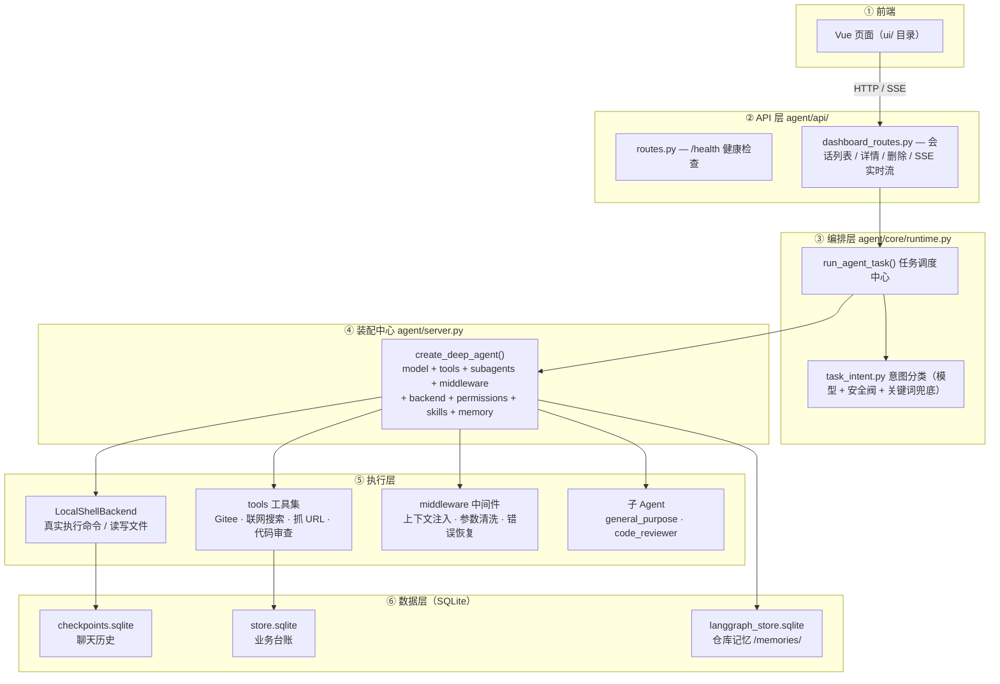
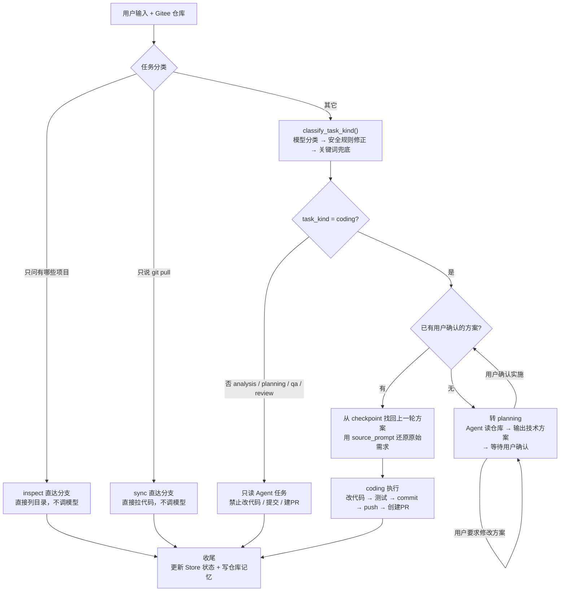
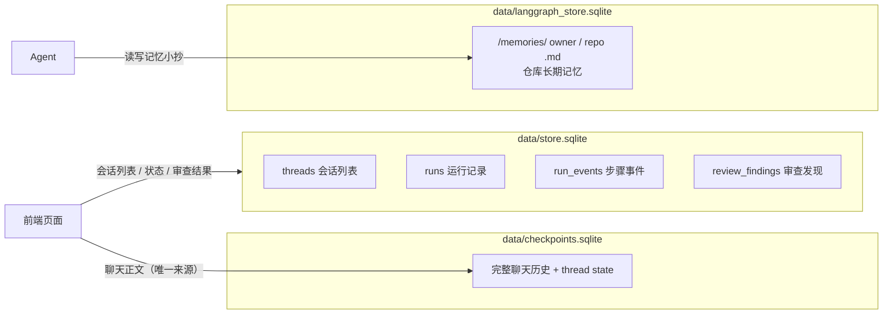

# LX-AICODING 项目理解指南

> 本文档写给任何人：无论你是第一次接触这个仓库的新同学、要接手维护的开发者，还是只想知道"这个项目到底是干嘛的"的读者，都可以从这份文档开始。
>
> 读完后，你应该能回答：**这个项目做什么？代码怎么组织？一次任务从输入到输出经历了什么？数据存在哪里？安全是怎么保障的？**

> **📚 配套文档**：想看"系统长什么样" → [SYSTEM_ARCHITECTURE.md](./SYSTEM_ARCHITECTURE.md)；想知道"从哪里开始看" → [ONBOARDING_GUIDE.md](./ONBOARDING_GUIDE.md)；想了解"一次用户请求进来后内部怎么走" → [REQUEST_FLOW.md](./REQUEST_FLOW.md)；想看"用户第一次请求"的完整时序图 → [FIRST_REQUEST_FLOW.md](./FIRST_REQUEST_FLOW.md)；想看"用户确认实施"的完整时序图 → [SECOND_REQUEST_FLOW.md](./SECOND_REQUEST_FLOW.md)；想理解"Agent 与真实电脑之间的安全边界" → [LOCAL_SHELL_BACKEND.md](./LOCAL_SHELL_BACKEND.md)；想理解"Agent 中间件体系" → [MIDDLEWARE.md](./MIDDLEWARE.md)；想看"三套 SQLite 数据库与表结构" → [DATABASE.md](./DATABASE.md)；想看"会话聊天记录如何恢复" → [THREAD_RECOVERY.md](./THREAD_RECOVERY.md)；面试前 → [INTERVIEW_GUIDE.md](./INTERVIEW_GUIDE.md)。

---

## 目录

1. [这是什么项目？](#1-这是什么项目)
2. [核心概念（先理解这 5 个词）](#2-核心概念先理解这-5-个词)
3. [技术栈](#3-技术栈)
4. [整体架构](#4-整体架构)
5. [目录结构速查](#5-目录结构速查)
6. [一次任务的完整旅程](#6-一次任务的完整旅程)
7. [数据存储：三套 SQLite 各管什么](#7-数据存储三套-sqlite-各管什么)
8. [安全防护是怎么做的](#8-安全防护是怎么做的)
9. [任务类型：Agent 有 7 种工作模式](#9-任务类型agent-有-7-种工作模式)
10. [技能系统（Skills）](#10-技能系统skills)
11. [已知问题与遗留代码](#11-已知问题与遗留代码)
12. [如何运行与调试](#12-如何运行与调试)
13. [代码阅读地图](#13-代码阅读地图)

---

## 1. 这是什么项目？

一句话：**这是一个"AI 程序员"平台的后端，用来做教学演示。**

它让一个大语言模型（LLM，目前是 DeepSeek）扮演一个能真实操作代码仓库的程序员：

- 你把一个 **Gitee 仓库地址** 和一句 **任务描述** 发给它（通过网页前端）；
- 它会**真实地**去克隆代码、阅读文件、修改代码、运行测试、提交并推送，最后创建一个 **Pull Request**；
- 它还能**只读**地完成其他工作：分析项目结构、输出技术方案、回答代码问题、审查代码改动。

几个关键设定：

- **教学目的**：这不是一个追求极致工程复杂度的大型系统，而是为了讲清楚"AI Agent 是怎么搭起来的"。代码里有大量中文注释，很多地方刻意做"功能减法"，方便课堂讲解。
- **平台限定**：只支持 **Gitee**（国内代码托管平台），只支持在**本地 Windows 工作区**（`E:\ai_workspace`）操作仓库。不支持 GitHub 等其它平台。
- **"先方案、后实施"**：默认情况下，Agent 不会一上来就改代码。它会先读懂需求、输出一份技术方案，等你确认后才真正动手改代码。这是产品流程层面的硬性保护，不是写在提示词里的软约束。

---

## 2. 核心概念（先理解这 5 个词）

| 概念 | 通俗解释 |
|---|---|
| **Agent（智能体）** | 一个"会动脑也会动手"的程序。动脑 = 调用 LLM 思考；动手 = 调用工具（读文件、跑命令、发请求）。本项目用 DeepAgents 框架创建 Agent。 |
| **Backend（后端/执行后端）** | Agent 的"手"。它决定 Agent 能碰哪些文件、能执行哪些命令。本项目是 `LocalShellBackend`：在本机 Windows 上真实执行。 |
| **Tool（工具）** | Agent 可以调用的"能力"。比如"搜网页"、"创建 PR"、"记录审查发现"。Agent 自己不能上网、不能发 HTTP 请求，必须通过工具。 |
| **Checkpoint（检查点）** | Agent 聊天的"存档"。每一轮对话、每一个中间状态都存下来，重启后能恢复历史。相当于聊天软件的聊天记录数据库。 |
| **Store（业务存储）** | 平台自己的"台账"。记录每个会话的状态、运行历史、审查发现等业务数据，供前端页面展示。和 checkpoint 是两套数据（见第 7 节）。 |

> 记忆口诀：**Agent 是大脑，Backend 是手，Tool 是工具包，Checkpoint 是聊天存档，Store 是业务台账。**

---

## 3. 技术栈

| 层 | 技术 |
|---|---|
| Web 框架 | FastAPI + Uvicorn（提供 HTTP 接口和 SSE 实时流） |
| Agent 框架 | DeepAgents（`create_deep_agent`）、LangChain、LangGraph |
| 大模型 | DeepSeek（`deepseek-v4-pro`），走 OpenAI 兼容协议 |
| 数据库 | SQLite（三个数据库文件，见第 7 节） |
| 前端（不在本仓库） | Vue/Vite（只提供 API，前端代码在 `ui/` 目录） |
| 其它 | httpx（HTTP 请求）、Pydantic（数据校验）、pytest/ruff |

**注意**：本项目是后端，前端 `ui/` 目录不在当前工作目录里。`scripts/start_all.py` 会同时启动后端和前端。

---

## 4. 整体架构

代码按「分层」组织，每一层只做自己的事。从上到下：



**一句话总结架构**：FastAPI 接请求 → runtime 决定"这轮跑什么" → server 拼装 Agent → DeepAgents 驱动 LLM 调用工具 → LocalShellBackend 在真实 Windows 上执行。

---

## 5. 目录结构速查

```
teacher_ai_coding/
├── agent/                      # 后端源码（核心）
│   ├── app.py                  # FastAPI 入口：初始化、CORS、注册路由
│   ├── server.py               # 【装配中心】get_agent()，拼装整个 Agent
│   ├── prompt.py               # 系统提示词（Agent 的"人设和规则"）
│   ├── env_utils.py            # 环境变量读取（.env）
│   ├── api/                    # HTTP 接口层
│   │   ├── routes.py           # /health 健康检查
│   │   └── dashboard_routes.py # Dashboard 前端接口（含 SSE 实时流）
│   ├── core/                   # 核心逻辑
│   │   ├── runtime.py          # 【任务调度中心】最重要的文件
│   │   ├── streaming_runtime.py# 消费 Agent 事件流 → 转成前端事件
│   │   ├── task_intent.py      # 意图分类（模型+关键词+安全阀）
│   │   ├── task_intent_keyword_backup.py # 关键词分类兜底
│   │   ├── settings.py         # 全局配置（路径、数据库、日志）
│   │   ├── model.py            # 模型创建（主模型/意图模型）
│   │   ├── graph.py            # 数据库实例的单例工厂
│   │   ├── persistence.py      # SQLite checkpointer / store 初始化
│   │   ├── state.py            # Agent 状态结构定义
│   │   ├── checkpoint_history.py # 从 checkpoint 读可见历史
│   │   ├── repo_memory.py      # 仓库级长期记忆（/memories/...）
│   │   ├── repo_memory_update.py # 任务后自动提炼记忆
│   │   ├── events.py           # 记录运行步骤事件
│   │   ├── logging_config.py   # 日志配置
│   │   ├── repo_mapping.py     # 【遗留】仓库目录映射（已不使用）
│   │   └── middleware/         # 中间件（上下文注入/消息清洗/参数清洗/错误恢复）
│   ├── backends/               # 执行后端
│   │   ├── local_shell.py      # 【核心】Windows 本地命令/文件执行 + 安全校验
│   │   ├── permissions.py      # 命令白名单、Git 参数收敛
│   │   └── workspace.py        # 工作区路径封装
│   ├── tools/                  # Agent 可调用的工具
│   │   ├── gitee_api.py        # Gitee API 底层封装（含 token 脱敏）
│   │   ├── gitee_tools.py      # Gitee 工具（创建 PR、读 PR 上下文）
│   │   ├── safe_http.py        # SSRF 防护的 HTTP 封装
│   │   ├── fetch_url_tools.py  # 抓取网页转 Markdown
│   │   ├── web_search.py       # 联网搜索
│   │   ├── reviewer_tools.py   # 审查结果工具（记录/读取 findings）
│   │   └── reviewer_diff.py    # git diff 解析、审查定位校验
│   ├── store/sqlite_store.py   # 业务 Store 的实现（各张表）
│   ├── memory/workspace.md     # 工作区说明文档（给 Agent 读的）
│   ├── reviewer_rules/         # 默认代码审查规则
│   └── skills/                 # 技能定义（3 个 SKILL.md）
├── scripts/
│   ├── start_all.py            # 一键启动后端+前端
│   └── stop_all.py             # 停止服务
├── data/                       # SQLite 数据库文件目录（运行时生成）
├── logs/                       # 日志目录（运行时生成）
└── .idea/                      # PyCharm 配置（不用管）
```

---

## 6. 一次任务的完整旅程

下面跟随一个真实场景走一遍。假设用户在网页上对仓库 `https://gitee.com/msb-goldbin/ai_coding.git` 说了一句 **"帮我给这个项目增加一个部门管理模块"**。

### 第 0 步：前端发起请求

前端把这句话和仓库地址 POST 到 `/dashboard/api/threads/stream-message`（`dashboard_routes.py`）。
后端返回一个 **SSE 实时流**（`text/event-stream`），也就是一条"边跑边播"的通道，Agent 每产生一点输出，前端都能实时显示。

### 第 1 步：API 层建会话、发初始事件

- `dashboard_routes.py` 生成一个 `thread_id`（会话 ID），调 `initialize_task_record()` 在业务 Store 里登记这个会话；
- 立刻向前端推送 `thread_snapshot`（会话元信息）、`user_message`（回显用户输入）、`message_start` + 一段"正在准备"的占位文本；
- 启动一个**后台线程**执行 Agent，主线程继续在 SSE 上等事件。

### 第 2 步：编排层决定"这轮跑什么"（runtime.py）

`run_agent_task()` 是本项目的"大脑中枢"，它按优先级判断：

1. 是不是只问"有哪些项目"？→ 直达分支，直接列目录，不调模型。
2. 是不是只说"把代码 pull 一下"？→ 直达分支，直接执行 git pull，不调模型。
3. 都不是 → 调用 `classify_task_kind()` 做**意图分类**：
   - 模型先分类（DeepSeek 输出结构化 JSON）；
   - 再过一个**安全规则**（用户说"只分析""不要修改"会被强制降级为只读）；
   - 模型不可用时回退到关键词兜底分类。

本例判断结果是 `coding`（开发实现）。

### 第 3 步：人在回路——先方案后实施（核心机制）

这是整个项目最有设计感的一步：



关键点：
- 用户后续说"**确认**"或"**开始实施**"时，runtime 不会把"确认"两个字直接当新需求，而是去 **checkpoint 存档**里找到最近一份等待确认的技术方案，用方案里保存的原始需求（`source_prompt`）作为执行目标。
- 这样保证了：**Agent 永远在人类确认方案后才动代码**。

### 第 4 步：装配 Agent（server.py）

`get_agent()` 把一个 Agent 完整拼装出来：

- **model**：DeepSeek 主模型；
- **tools**：联网搜索、抓 URL、创建/复用 Gitee PR、发布 PR 评论、读取 PR 上下文、读取默认审查规则、获取 diff 摘要、记录/汇总审查发现；
- **subagents**：两个子 Agent——`general_purpose`（只读分析）、`code_reviewer`（只读审查）。子 Agent 权限更小，不能改代码；
- **backend**：`LocalShellBackend`，绑定到本 thread，真实执行命令；
- **permissions**：一套文件系统权限，主 Agent 只能写 `/projects`、`/reviews`、`/tmp`、`/memories`，不能碰 `/skills`、`/policies` 等关键目录；
- **middleware**：五个中间件，在任务前/中/后做清洗和保护；
- **skills / memory**：技能和仓库长期记忆；
- **checkpointer**：存档。

### 第 5 步：真正运行（streaming_runtime.py）

DeepAgents 跑起来后会产生大量底层事件（模型输出的每一个字、调用了哪个工具、子 Agent 在干什么）。`streaming_runtime.py` 把这些翻译成前端能理解的事件，通过 SSE 推给浏览器：

- `text_delta`：模型输出的文字增量（边想边打字的效果）；
- `todo_delta`：任务清单进度（Agent 用 `write_todos` 工具列的计划）；
- `tool` 事件：当前正在调用什么工具；
- `subagent` 事件：子 Agent 的分析过程。

### 第 6 步：收尾（回到 runtime.py）

- 更新业务 Store：会话状态 → `completed`；
- 提取最终回答，**自动更新仓库长期记忆**（`repo_memory_update.py`），把技术栈、测试命令、最近结论写回 `/memories/{owner}/{repo}.md`；
- 推送 `thread_done` + `done` 事件，告诉前端结束实时流。

> 如果中途出错，也有对应的异常处理：关闭未完成事件、把会话标记为 `failed`、推送错误事件，保证前端永远不会卡在"运行中"。

---

## 7. 数据存储：三套 SQLite 各管什么

这是本项目最容易混淆的一点，用一张表说清楚：

| 数据库文件 | 存的什么 | 谁来读 | 类比 |
|---|---|---|---|
| `data/checkpoints.sqlite` | **完整聊天历史**：每一轮用户消息、Agent 回复、工具调用中间态 | 前端展示历史、恢复上下文、找上一轮方案 | 微信聊天记录 |
| `data/store.sqlite` | **业务台账**：会话列表（threads）、每次运行（runs）、运行步骤（run_events）、审查发现（review_findings） | 前端左侧会话列表、任务状态、审查结果 | 订单管理系统 |
| `data/langgraph_store.sqlite` | **仓库长期记忆**：每个仓库一份 `/memories/{owner}/{repo}.md` | Agent 下次处理该仓库时的"小抄" | 员工的备忘录 |

三者关系与读写边界用一张图表示：



**设计原则（重要）**：
- 前端**聊天正文只从 checkpoint 读**，不从 Store 读。这样可以避免"两个数据源打架"（重复、乱序、覆盖）。
- Store 只存"业务摘要"。删除会话时两边一起删。
- 仓库记忆按 `owner/repo` 隔离，不同仓库互不干扰。

---

## 8. 安全防护是怎么做的

这个项目的安全设计值得重点学习，因为**让 AI 真的操作你的电脑是有风险的**。防护做了五层：

### ① Token 脱敏（防泄密）
- 全项目统一用 `mask_token()` 把 Gitee Token 替换成 `***`。
- 应用在：命令输出、日志、异常信息、发给模型的内容、仓库记忆……所有可能泄露的地方。
- Git 认证用 askpass 脚本 + 环境变量注入，**Token 绝不写进命令字符串**。

### ② 路径保护（防越权）
- 所有文件操作最终必须落在工作区 `E:\ai_workspace` 内，越界直接报 `PermissionError`。
- 拒绝 `..` 穿越、拒绝访问 `.secrets`（敏感凭据目录）。
- 拒绝 `projects/projects` 这类嵌套路径错误。

### ③ 命令白名单（防危险命令）
- Agent 只能执行白名单里的命令：`python`、`pytest`、`pip`、`git`、`dir`、`type` 等。
- 拒绝 shell 操作符（`&&`、`|`、`;` 等）、拒绝 `rm -rf`、`reg delete` 等危险片段。
- Git 分支名、commit message 都做字符校验，防注入。

### ④ 只读约束（防乱改）
- 关键目录只读：`/skills`、`/policies`、`/runtimes`、`/logs`、`.secrets`，Agent 只能读不能写。
- 业务只读：`analysis/planning/qa/inspect/review` 都是只读任务，其中 `open_gitee_pull_request`（创建 PR）会**直接拒绝**。

### ⑤ 网络保护（防 SSRF 攻击）
- `safe_http.py` 抓取 URL 时做 DNS pin（防止 DNS rebinding 攻击）+ 内网/回环 IP 黑名单，防止 Agent 被诱导访问内网服务。

### ⑥ 运行保护（防失控）
- 每个任务类型限制工具调用次数和总时长（coding 最高 300 次 / 1800 秒），防止模型死循环烧钱。

---

## 9. 任务类型：Agent 有 7 种工作模式

`task_intent.py` 把用户输入分成 7 类，每类有不同的提示词、权限和流程：

| 类型 | 含义 | 是否只读 | 典型输入 |
|---|---|---|---|
| `coding` | 开发实现 | ❌ 可改代码 | "帮我实现 XX 功能" |
| `planning` | 技术方案 | ✅ | "先给我一个方案" |
| `analysis` | 项目分析 | ✅ | "分析一下项目结构" |
| `qa` | 问答 | ✅ | "这个函数是干嘛的？" |
| `review` | 代码审查 | ✅ | "帮我 review 一下 PR" |
| `sync` | 同步代码 | ✅ | "把代码 pull 一下" |
| `inspect` | 查看工作区 | ✅ | "本地有哪些项目？" |

分类采用**三层保障**：
1. 简单任务用关键词快速判断（不浪费模型调用）；
2. 复杂任务用模型结构化分类；
3. 任何结果都经过**安全规则修正**（模型说 coding 但用户说了"只分析"，强制降级为只读）。

---

## 10. 技能系统（Skills）

技能（skill）是给 Agent 的"工作方法手册"，教它遇到不同类型任务时按什么步骤做。项目内置 3 个：

| 技能 | 用途 |
|---|---|
| `repo-bootstrap-analysis` | 第一次接触某个仓库：先建立项目认知再动手 |
| `ai-coding-implementation` | 复杂开发任务的三阶段实施流程 |
| `code-review` | 代码审查流程：读规则 → 分析 diff → 记录 findings → 输出报告 |

技能放在 `E:\ai_workspace\skills` 下，通过 `/skills/` 虚拟路径暴露给 Agent。Agent 会按系统提示词的引导，在合适时机"翻看"对应技能来指导自己的行为。

---

## 11. 已知问题与遗留代码

以下是阅读代码时要注意的地方：

### ⚠️ prompt.py 存在乱码（建议修复）
`agent/prompt.py` 第 22-30 行，`BASE_SYSTEM_PROMPT` 中"工作区工作方式"一节的**中文全部变成了 `?????`**。这段是发给模型的系统提示词，乱码会导致 Agent 缺少工作区操作规则。全项目仅此一处。

### 死代码（未被任何模块引用）
| 文件 | 说明 |
|---|---|
| `agent/core/middleware/momory_update.py` | 拼写错误（momory），是 `memory_update.py` 的早期草稿，未接线 |
| `agent/core/middleware/memory_update.py` | 与上面几乎相同，也未接线（真实写记忆逻辑在 runtime.py） |
| `agent/core/repo_mapping.py` | 仓库目录映射，已被"URL 解析固定推导目录"取代 |

### 遗留数据结构
- `store.sqlite` 中 `thread_messages`、`thread_plans` 表和对应方法仍在，但新链路不再写入（聊天历史走 checkpoint，方案不落库）。
- `repo_workspace_mappings` 表及方法无运行时调用。

### 环境差异
- 项目硬编码 Windows 工作区 `E:\ai_workspace`，目标运行环境是 Windows。若在 macOS/Linux 上直接跑真实 Agent 流程，工作区路径不存在，需要调整 `AI_WORKSPACE_ROOT`。

---

## 12. 如何运行与调试

### 启动
```bash
# 一键启动后端(127.0.0.1:2024) + 前端(127.0.0.1:3000)
python scripts/start_all.py
```
前提：`.venv` 存在、前端 `ui/` 目录就位、`.env` 里配好 `DEEPSEEK_API_KEY`、`DEEPSEEK_BASE_URL`、`GITEE_TOKEN`。

### 环境变量（.env）
| 变量 | 作用 |
|---|---|
| `DEEPSEEK_API_KEY` / `DEEPSEEK_BASE_URL` | 模型连接 |
| `MAIN_MODEL` | 主模型名（默认 `deepseek-v4-pro`） |
| `GITEE_TOKEN` / `SCM_GITEE_TOKEN` | Gitee 访问令牌 |
| `AI_WORKSPACE_ROOT` | 本地工作区根目录（默认 `E:\ai_workspace`） |
| `LX_AICODING_DATA_DIR` / `LX_AICODING_LOG_DIR` | 数据/日志目录 |

### 观察运行
- 控制台看日志；
- `data/` 下三个 SQLite 可以直接打开看数据；
- `logs/backend.log`、`logs/agent-runs.log` 记录运行详情。

---

## 13. 代码阅读地图

如果你要深入读代码，建议按这个顺序（由浅入深）：

1. **`agent/prompt.py`** — 先看 Agent 的"人设"，理解它被要求怎么工作；
2. **`agent/api/dashboard_routes.py`** — 看外部如何调用；
3. **`agent/core/runtime.py`** — 核心调度流程，看懂"先方案后实施"；
4. **`agent/server.py`** — 看 Agent 是怎么被拼装出来的；
5. **`agent/core/task_intent.py`** — 看意图分类和安全阀；
6. **`agent/backends/local_shell.py` + `agent/backends/permissions.py`** — 看"手"和安全边界；
7. **`agent/tools/`** — 看 Agent 的"工具包"；
8. **`agent/core/middleware/`** — 看清洗和保护；
9. **`agent/store/sqlite_store.py`** — 最后看数据落盘。

---

*本文档由分析项目代码自动生成，用于帮助任何人快速理解这个 AI 编程教学项目。*
