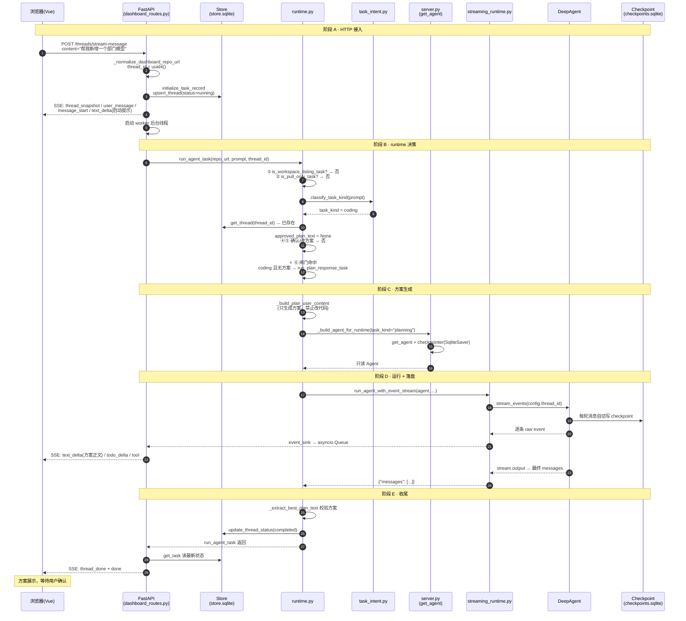

# 请求决策流程图 —「帮我新增一个部门模型」完整走查

> 本文档用一张**详细决策流程图** + 分阶段代码走查，讲清楚「用户第一次输入开发需求」时，代码从入口到结束的每一步。
>
> 核心结论：**第一次说"帮我新增一个部门模型"，不会写代码——会被闸门强制转 planning，只输出技术方案，等用户确认。**
>
> 配套：[REQUEST_FLOW_GUIDE.md](./REQUEST_FLOW_GUIDE.md)（时序图版）· [FIRST_REQUEST_FLOW.md](./FIRST_REQUEST_FLOW.md) · [REQUEST_FLOW.md](./REQUEST_FLOW.md)

---

## 1. 完整决策流程图

```mermaid
flowchart TD
    START(["👤 用户输入<br/>帮我新增一个部门模型"]) --> S1

    subgraph SA["阶段 A · HTTP 接入（dashboard_routes.py）"]
        S1["POST /threads/stream-message"] --> S2["_normalize_dashboard_repo_url<br/>repo → 完整 URL"]
        S2 --> S3["thread_id = uuid4()"]
        S3 --> S4["initialize_task_record<br/>写 threads 表（status=running）"]
        S4 --> S5["启动 worker 后台线程"]
    end

    subgraph SB["阶段 B · runtime 决策（runtime.py）"]
        S5 --> B1["run_agent_task(prompt)"]
        B1 --> B2{"① 是列项目？<br/>is_workspace_listing_task"}
        B2 -- 否 --> B3{"② 是 git pull？<br/>is_pull_only_task"}
        B3 -- 否 --> B4["③ 意图分类<br/>classify_task_kind → coding"]
        B4 --> B5["existing_thread 已存在<br/>approved_plan_text = None"]
        B5 --> B6{"④ 说确认了？<br/>_is_approval_prompt"}
        B6 -- 否 --> B7{"⑤ 说改方案？<br/>_is_plan_revision_prompt"}
        B7 -- 否 --> B8{"⑥ 核心闸门<br/>coding 且 无确认方案？"}
        B8 -- "是 ⭐ 命中" --> C1
        B2 -- 是 --> LX["run_workspace_listing_task<br/>不调模型"]
        B3 -- 是 --> LY["run_pull_only_task<br/>不调模型"]
    end

    subgraph SC["阶段 C · 方案生成（runtime.py:712）"]
        C1["run_plan_response_task<br/>task_kind 强制 = planning"] --> C2["_build_plan_user_content<br/>提示词：只生成方案，禁止改代码"]
        C2 --> C3["_build_agent_for_runtime<br/>装配【只读】Agent"]
        C3 --> C4["get_agent（server.py）<br/>checkpointer = SqliteSaver"]
    end

    subgraph SD["阶段 D · 运行 + 落盘（streaming_runtime.py）"]
        C4 --> D1["run_agent_with_event_stream<br/>stream_events(thread_id)"]
        D1 --> D2["Agent 读仓库（只读）"]
        D2 --> D3["Agent 输出技术方案（AIMessage）"]
        D3 --> D4["LangGraph 自动落盘<br/>checkpoints.sqlite"]
    end

    subgraph SE["阶段 E · 收尾"]
        D4 --> E1["_extract_best_plan_text<br/>校验方案确实生成了"]
        E1 --> E2["update_thread_status(completed)"]
        E2 --> E3["SSE 推 thread_done + done"]
        E3 --> END(["✅ 结果：不写代码<br/>方案停在「是否确认实施该方案？」"])
    end
```



---

## 2. 时序图（sequenceDiagram）



---

## 3. 分阶段代码走查

### 阶段 A：HTTP 接入

```python
# dashboard_routes.py:529
@dashboard_router.post("/threads/stream-message")
async def dashboard_stream_new_message(body):
    repo_url = _normalize_dashboard_repo_url(body.repo)   # owner/repo → 完整 URL
    thread_id = str(uuid.uuid4())                          # 生成新会话 ID
    return _post_streaming_response(thread_id=thread_id, repo_url=repo_url, content=body.content)

# dashboard_routes.py:340 → 397 → 494
initialize_task_record(...)     # 先写 threads 表
threading.Thread(target=worker, ...).start()   # 后台线程跑 Agent
```

### 阶段 B：runtime 决策（核心）

```python
# runtime.py:817
def run_agent_task(*, repo_url, prompt, thread_id=None, event_sink=None):
    if is_workspace_listing_task(prompt):      # ① 否
        return run_workspace_listing_task(...)
    if is_pull_only_task(prompt):              # ② 否
        return run_pull_only_task(...)

    task_kind = classify_task_kind(prompt)     # ③ → "coding"

    thread_id = thread_id or uuid4()
    existing_thread = store.get_thread(thread_id)   # 已存在
    approved_plan_text = None                       # 关键：无确认方案

    if existing_thread and _is_approval_prompt(prompt):   # ④ 否（不是"确认"）
        ...
    elif existing_thread:                                # ⑤ 否（不是"改方案"）
        plan_message = _latest_confirmable_plan_message(thread_id) if _is_plan_revision_prompt(prompt) else None
        # plan_message = None，跳过

    if approved_plan_text is not None:                   # 否
        task_kind = "coding"

    # ⑥ 核心闸门
    if task_kind == "coding" and approved_plan_text is None:
        return run_plan_response_task(...)               # ⭐ 命中，转 planning
```

### 阶段 C：方案生成

```python
# runtime.py:712
def run_plan_response_task(*, repo_url, prompt, ...):
    repo = parse_gitee_repo_url(repo_url)
    agent = _build_agent_for_runtime(thread_id=thread_id, task_kind="planning", repo_url=repo.clone_url)
    result = run_agent_with_event_stream(
        agent=agent,
        content=_build_plan_user_content(repo_url=repo.clone_url, prompt=prompt),
        task_kind="planning",
        ...
    )
```

`_build_plan_user_content`（`runtime.py:267`）生成的提示词明确要求：

> 请只生成技术方案，不要修改文件、不要提交、不要 push、不要创建 Pull Request。
> 最后必须单独输出一句：是否确认实施该方案？

### 阶段 D：运行 + 落盘

```python
# server.py:464
checkpointer=get_checkpointer()   # SqliteSaver，连 checkpoints.sqlite

# streaming_runtime.py:725-729
stream = agent.stream_events(
    {"messages": [{"role": "user", "content": content}]},
    version="v3",
    config={"configurable": {"thread_id": thread_id}},
)
# Agent 输出方案 AIMessage → LangGraph 自动落盘 checkpoints.sqlite
```

### 阶段 E：收尾

```python
# runtime.py:789-796
if not _extract_best_plan_text(messages):
    raise RuntimeError("技术方案生成失败：模型没有返回可用方案")
store.update_thread_status(thread_id, "completed")
record_event(thread_id, "plan", "技术方案已输出，等待确认", ...)
```

---

## 4. 三个关键节点

| 节点 | 位置 | 意义 |
|---|---|---|
| **⑥ 核心闸门** | `runtime.py:894` | `coding` 且无确认方案 → 强制转 planning，这是"先方案后实施"的硬约束 |
| **C1 task_kind 强制 planning** | `runtime.py:712` | 分类明明是 coding，到这里被改成 planning，Agent 变只读 |
| **D4 自动落盘** | LangGraph 框架 | 方案不是代码显式写，是 SqliteSaver 自动存进 checkpoints.sqlite |

---

## 5. 第一次 vs 第二次（决策差异）

| 节点 | 第一次「帮我新增部门模型」 | 第二次「确认实施」 |
|---|---|---|
| ④ _is_approval_prompt | 否 | **是** |
| approved_plan_text | None | **方案全文**（从 checkpoint 反查） |
| ⑥ 闸门 | **命中** → 转 planning | 不命中 → 走 coding |
| 最终 | 只读出方案 | 改代码/测试/push/建 PR |

---

## 6. 一句话总结

> 这条输入的代码路径，最关键的是**第 ⑥ 步闸门**——它让 `run_agent_task` 提前 return，改走 `run_plan_response_task`，把 `task_kind` 从 coding 换成 planning，于是 Agent 从头到尾都是只读的，只出方案、不写代码。

---

*本文档为 REQUEST_FLOW_GUIDE.md 的"决策流程图"互补版，聚焦第一次请求的完整决策路径。*
