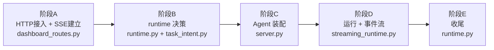
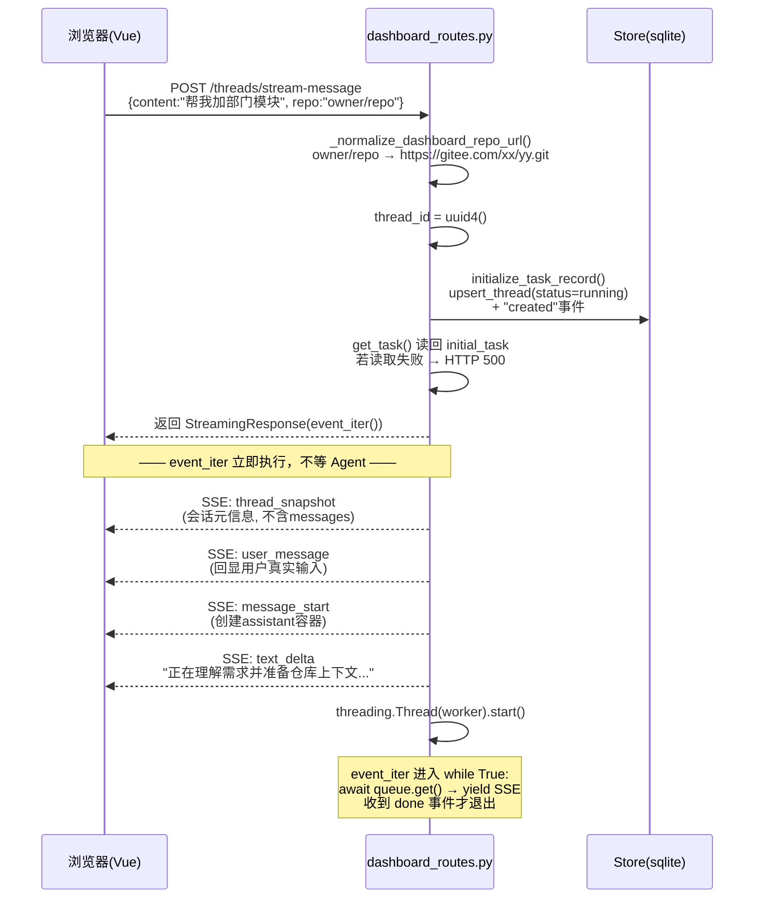
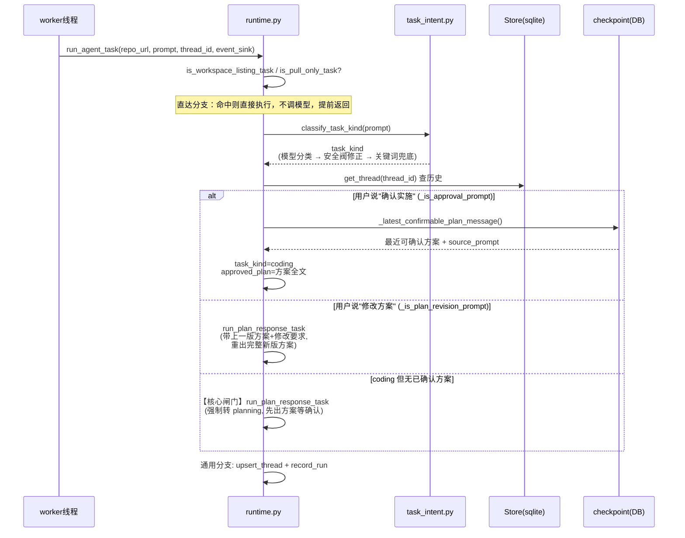
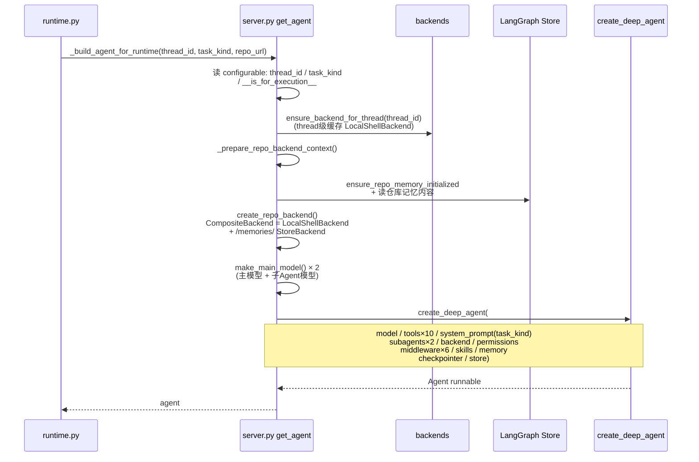
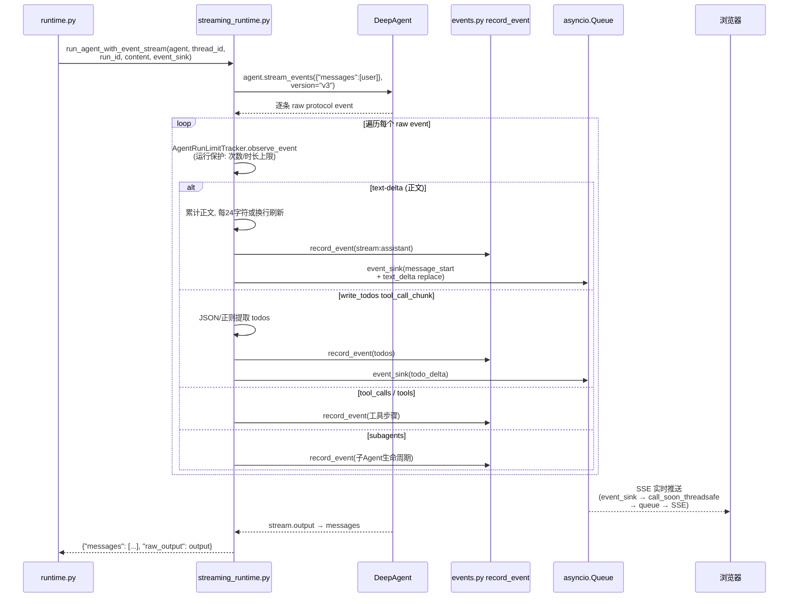
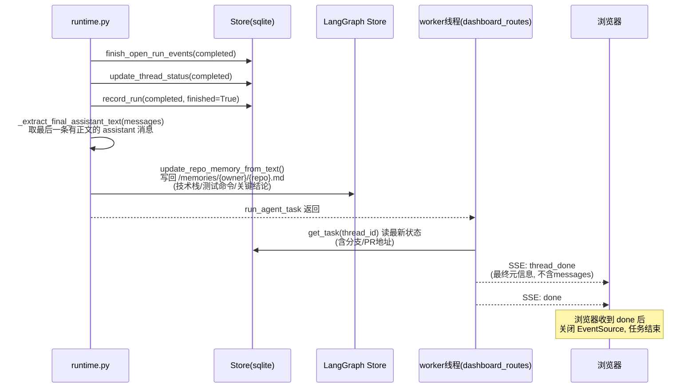
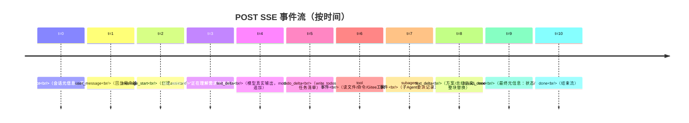

# 用户请求完整链路图解

> 本文档用图说明「用户在前端输入一句话后，系统内部发生了什么」。
> 覆盖从 HTTP 入口到 SSE 关闭的完整生命周期。
>
> **阅读方式**：先看 [总览（地图）](#总览地图)，再按阶段逐个看 [分阶段时序图](#分阶段时序图核心)。
> 相关代码入口：`agent/api/dashboard_routes.py` → `agent/core/runtime.py` → `agent/core/streaming_runtime.py`
> 配套文档：[PROJECT_ANALYSIS.md](./PROJECT_ANALYSIS.md) · [SYSTEM_ARCHITECTURE.md](./SYSTEM_ARCHITECTURE.md)

---

## 目录

- [总览（地图）](#总览地图)
- [分阶段时序图（核心）](#分阶段时序图核心)
  - [阶段 A：HTTP 接入与 SSE 建立](#阶段-ahttp-接入与-sse-建立)
  - [阶段 B：runtime 决策](#阶段-bruntime-决策)
  - [阶段 C：Agent 装配](#阶段-cagent-装配)
  - [阶段 D：Agent 运行与事件流](#阶段-dagent-运行与事件流)
  - [阶段 E：收尾](#阶段-e收尾)
- [SSE 事件时间线](#sse-事件时间线)
- [跑一个具体例子](#跑一个具体例子)
- [一句话总结](#一句话总结这条链路)

---

## 总览（地图）

完整生命周期按 5 个阶段串起来。每个阶段在下方有独立详图：

---

## 分阶段时序图（核心）

### 阶段 A：HTTP 接入与 SSE 建立

**发生位置**：`dashboard_routes.py:529`（`dashboard_stream_new_message`）→ `:324`（`_post_streaming_response`）→ `:350`（`event_iter`）

**要点**：
- 4 个初始事件（`thread_snapshot` / `user_message` / `message_start` / 启动 `text_delta`）在 **Agent 还没开始跑之前**就推给浏览器，避免"页面无响应"（`dashboard_routes.py:439-491`）。
- `initialize_task_record`（`runtime.py:507`）只写业务 Store，**不写用户消息**——用户消息展示由 SSE 的 `user_message` 事件负责，稳定历史由 checkpoint 负责。
- `thread_id` 是贯穿整条链路的唯一主键，绑定 Store / checkpoint / SSE / Agent config。

---

### 阶段 B：runtime 决策

**发生位置**：`runtime.py:817`（`run_agent_task`）→ `task_intent.py:371`（`classify_task_kind`）

**要点**：
- **直达分支**（`runtime.py:839-843`）：`inspect`（列项目）、`sync`（git pull）不调用模型，直接执行并返回。
- **`classify_task_kind` 三层保障**（`task_intent.py:371-404`）：模型结构化分类 → `_apply_security_guard` 安全阀强制只读 → 模型失败时回退关键词备份分类。
- **核心闸门**（`runtime.py:894`）：`task_kind == coding` 且无 `approved_plan` → 强制 `run_plan_response_task`。这是"先方案、后实施"的确定性产品流程。
- **方案确认恢复**：`_latest_confirmable_plan_message` 从 checkpoint 反查，用 `source_prompt` 还原用户原始需求，而不是把"确认"两个字当需求。

---

### 阶段 C：Agent 装配

**发生位置**：`runtime.py:46`（`_build_agent_for_runtime`）→ `server.py:363`（`get_agent`）

**要点**：
- **backend 按 thread 缓存**（`server.py:73,88`）：同一个会话内复用 `LocalShellBackend`，不重复初始化 Windows 工作区。
- **CompositeBackend 双路由**（`server.py:336-360`）：`/projects`、`/skills`、命令执行走 `LocalShellBackend`；`/memories/` 是虚拟路径，走 `StoreBackend` 落到 LangGraph Store。
- **装配内容一览**（`server.py:422-467`）：10 个业务工具 + 2 个子 Agent（general_purpose / code_reviewer，都只读）+ 6 个中间件 + 文件系统权限 + skills + memory + checkpointer。
- **6 个中间件**：`ContextInjection`（注入仓库记忆）、`MessageSanitize`（清洗消息）、`SanitizeToolInputs`（清洗工具参数）、`create_summarization_tool_middleware`（上下文压缩）、`ModelCallLimitMiddleware`（模型调用上限 5000）、`ToolError`（工具错误恢复）。
- 每次运行都重新 `get_agent()`，但对话状态不靠 Python 对象驻留，靠 checkpoint 持久化。

---

### 阶段 D：Agent 运行与事件流

**发生位置**：`runtime.py:939`（`run_agent_with_event_stream`）→ `streaming_runtime.py:706`

**要点**：
- **事件桥接**：`event_sink`（`dashboard_routes.py:375`）→ `enqueue` → `loop.call_soon_threadsafe(queue.put_nowait)` → `event_iter` 的 `await queue.get()` → SSE yield。这是 worker 线程与 asyncio 事件循环之间的桥（详见 [并发桥接](#sse-事件时间线) 下一节说明）。
- **正文流式刷新策略**（`streaming_runtime.py:215`）：首段立即展示；累计新增 24 字符刷新一次；遇换行也刷新。避免每个 token 都写 SQLite。
- **`mode` 区分**（`streaming_runtime.py:482`）：流式增量用 `append`，完整 assistant 文本块用 `replace`，避免重复拼接。
- **write_todos 渐进解析**（`streaming_runtime.py:344`）：工具参数 JSON 未闭合时用正则提取已完整的 todo，让任务清单逐项出现。
- **运行保护**：`AgentRunLimitTracker` 计数工具调用/模型调用，超限抛 `AgentRunLimitExceeded`。

---

### 阶段 E：收尾

**发生位置**：`runtime.py:953-972`（通用分支收尾）→ `dashboard_routes.py:397`（worker 线程收尾）

**要点**：
- **异常路径**（`runtime.py:975-990`）：必须同时做三件事——`finish_open_run_events(error)` + `update_thread_status(failed)` + `record_run(failed)`，否则前端会永远停在"运行中"。
- **仓库记忆只记最终结论**（`runtime.py:959-972`）：`_extract_final_assistant_text` 从后往前找最后一条 AI 消息，不把中间工具消息、todo 状态写进长期记忆。
- **失败也要发 done**（`dashboard_routes.py:426-437`）：worker 捕获异常后仍会推 `error` + `thread_done` + `done`，保证浏览器不挂起。
- 所有对外暴露的错误信息都过 `mask_token()` 脱敏。

---

## SSE 事件时间线

前端在一个完整任务里会依次收到（来源见 `streaming_runtime.py` 和 `dashboard_routes.py`）：

---

## 跑一个具体例子

假设用户对 `msb-goldbin/ai_coding` 说了一句 **"帮我给这个项目增加一个部门管理模块"**。

### 第 1 轮（前端 → SSE 建立）

1. 浏览器 POST，后端 `dashboard_routes.py:529` 接住 → 规范化仓库 URL → 生成 `thread_id`
2. `initialize_task_record()`（`runtime.py:507`）写入 Store：thread 状态 `running`
3. 立即推 4 个事件：`thread_snapshot` → `user_message` → `message_start` → 启动提示文本
4. 启动 worker 线程，`event_iter` 进入 `while True` 等队列

### 第 1 轮（runtime 决策）

5. 不是"有哪些项目"，不是"git pull" → `classify_task_kind()`（`task_intent.py:371`）
   - 模型把"增加部门管理模块"判为 `coding`，安全阀检查后无"只读"字样，放行
6. `existing_thread` 存在，但用户没说"确认"，也没说"修改方案"
7. `task_kind == coding` 但 **`approved_plan_text is None`** → 命中核心闸门（`runtime.py:894`）→ `run_plan_response_task()`，**task_kind 强制 planning**
8. 构建只读 Agent → `stream_events` → 读仓库、输出技术方案，结尾"是否确认实施该方案？"，方案进 checkpoint
9. 收尾：Store `completed`，SSE 推 `thread_done` + `done`

### 第 2 轮（用户输入"确认实施"）

10. 同一 `thread_id` 再 POST
11. `_is_approval_prompt("确认实施")` → True（`runtime.py:858`）
12. `_latest_confirmable_plan_message()` 从 checkpoint 反查最近方案（`runtime.py:863`）
13. 取方案的 `source_prompt`（= 第一轮的原始需求），`task_kind = "coding"`
14. `_build_agent_user_content()`（`runtime.py:181`）把方案全文作为 `approved_plan` 注入
15. Agent 读仓库 → 改代码 → 跑测试 → `git push` → `open_gitee_pull_request` 建 PR
16. 收尾：提取最终总结写入仓库记忆 `/memories/msb-goldbin/ai_coding.md`（`runtime.py:963`），Store 记 PR 地址，SSE 推 `thread_done`（含 PR）+ `done`

---

## 一句话总结这条链路

> **FastAPI 接请求 → 先推"会话建立"事件 → 后台线程跑 runtime 决策（直达分支/意图分类/方案确认闸门）→ DeepAgent 边跑边把 text/todo/tool 事件经 asyncio.Queue 桥回 SSE → 结束后写 Store 状态 + 仓库记忆 → `done` 关闭流。**

这条链路里最值得记住的三个设计：

1. **「先方案后实施」是确定性产品流程**，不是提示词软约束（`runtime.py:894` 的闸门）。
2. **Store 只管业务摘要，checkpoint 才是正文唯一来源**——SSE 实时增量 + checkpoint 稳定历史，两者分工明确。
3. **生产者-消费者线程模型**让实时流和 Agent 同步执行互不阻塞。

---

*本文档由分析项目代码整理，用于快速理解一次用户请求的完整链路。*
