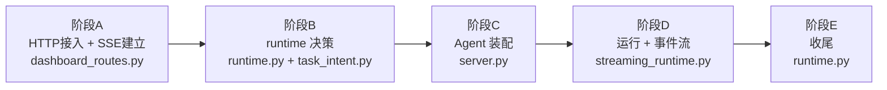
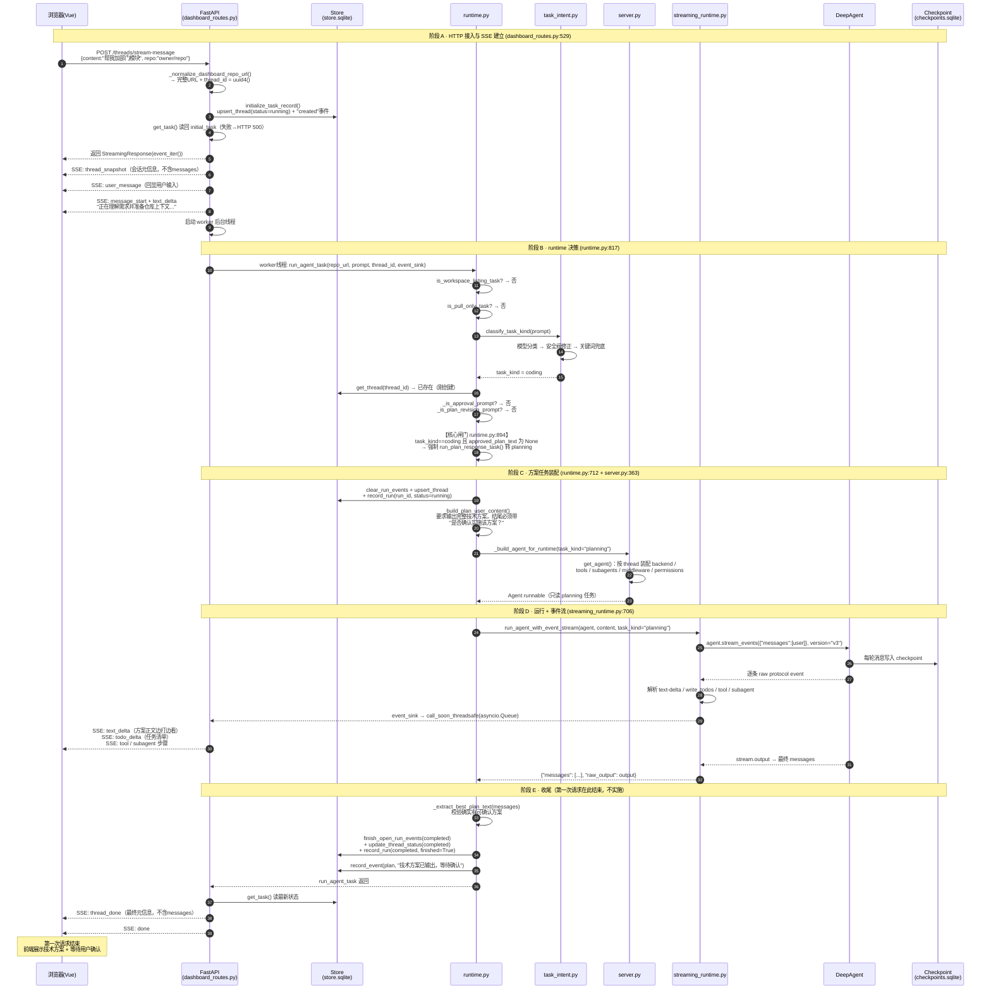
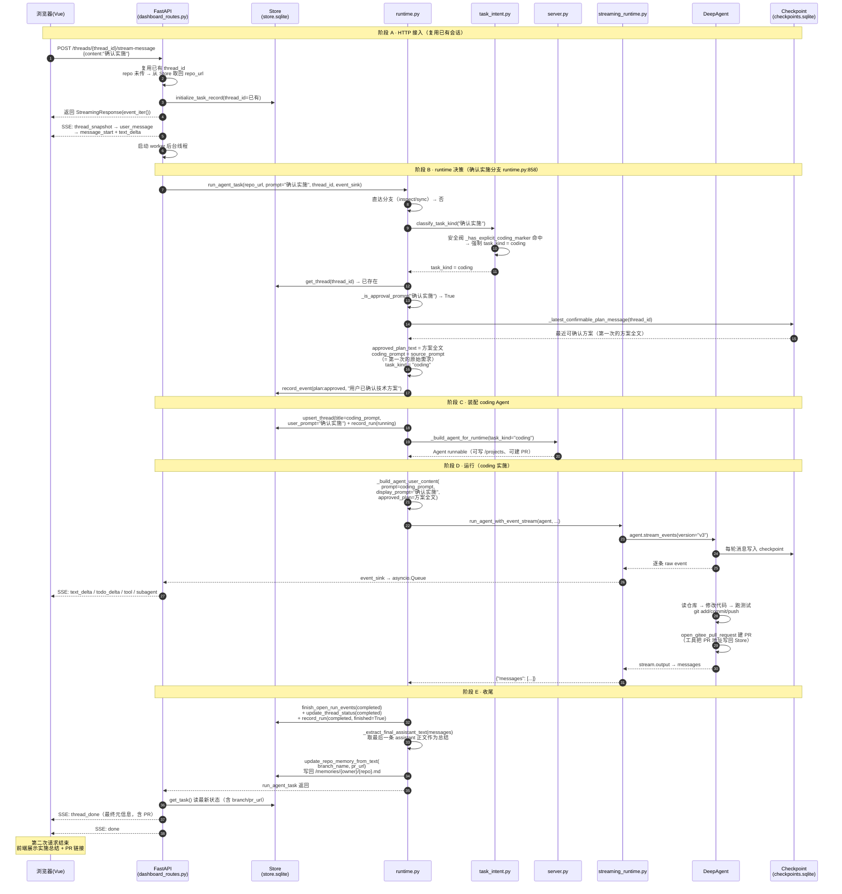
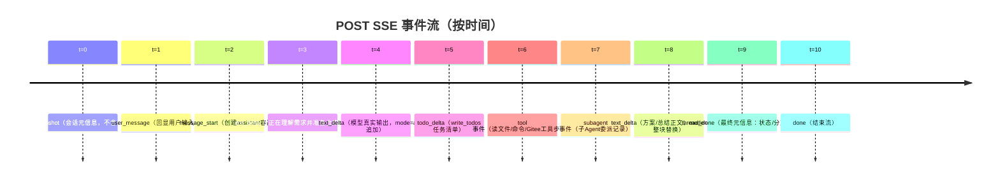

# 用户请求完整流程指南

> 本文档用一张完整的时序图 + 分阶段精讲，讲清楚「用户在前端输入一句话后，系统内部从头到尾发生了什么」。
> 面向学习：先看总览图，再看第一次/第二次两张时序图，最后看"关键转折点"。
>
> 配套（更细的专题版）：[REQUEST_FLOW.md](./REQUEST_FLOW.md) · [FIRST_REQUEST_FLOW.md](./FIRST_REQUEST_FLOW.md) · [SECOND_REQUEST_FLOW.md](./SECOND_REQUEST_FLOW.md)

---

## 1. 一句话总结

> **前端 POST → 先推 4 个「会话建立」事件 → 后台线程跑 runtime 决策 → DeepAgent 边跑边把 token/工具事件经 asyncio 队列桥回 SSE → 结束写 Store 状态 + 仓库记忆 → 发 `done` 关流。**

### 三个核心心智模型（先记住）

1. **`thread_id` 是贯穿全局的唯一主键** —— 绑定 Store / checkpoint / SSE / Agent config，一路都不换。
2. **Store 只管业务摘要，checkpoint 才是聊天正文唯一来源** —— SSE 负责实时增量，checkpoint 负责刷新后的稳定历史。
3. **「先方案后实施」是确定性产品流程** —— 不是 prompt 软约束，是 `runtime.py` 里的一行硬判断。

---

## 2. 总览图（5 阶段骨架）



---

## 3. 完整时序图（第一次请求：新会话 → 出方案）

> 场景：用户第一次输入 `"帮我加一个部门管理模块"`，新会话、无历史。
> 核心结论：第一次请求**不会进入 coding 实施**，会被闸门强制转 planning，只输出技术方案。



---

## 4. 完整时序图（第二次请求：确认实施 → 真正写代码）

> 场景：第一次已输出方案（存在 checkpoint），用户回复 `"确认实施"`。
> 核心结论：runtime 从 checkpoint 反查方案、还原原始需求，**真正进入 coding**：改代码 → 测试 → 提交 → push → 建 PR。



---

## 5. 关键转折点精讲

### ① 「先方案后实施」的闸门（`runtime.py:894`）

```python
if task_kind == "coding" and approved_plan_text is None:
    return run_plan_response_task(...)   # 强制转 planning
```

- 只要分类结果是 `coding`，又没有"已确认方案"，**强制转 planning**。
- 这是三层保障里最硬的一层：模型分类（第一层）→ runtime 闸门改判（第二层）→ prompt 里写"禁止修改/提交/建 PR"（第三层）。

### ② 确认实施时，「确认」两个字不当需求用（`runtime.py:867-870`）

```python
approved_plan_text = 方案全文
coding_prompt = metadata.get("source_prompt")  # 第一次的原始需求
```

- `display_prompt`（= "确认实施"）用于前端展示；
- `coding_prompt`（= 原始需求）才是真正喂给 Agent 的执行目标。
- 两者分离，避免前端误判重复，也避免把"确认"当需求。

### ③ 没有可确认方案时的防御（`runtime.py:887-889`）

用户说"确认"，但 checkpoint 里找不到方案 → 把"确认"当普通问题重新分类，**绝不误执行旧任务**。

---

## 6. 第一次 vs 第二次（对照表）

| 环节 | 第一次请求 | 第二次请求（确认实施） |
|---|---|---|
| thread_id | 新生成 | 复用现有 |
| 输入 | 原始需求 | "确认实施" |
| 意图分类 | 模型判 coding → 被闸门改 planning | 安全阀强制 coding |
| checkpoint | 输出方案（awaiting_confirmation） | 反查方案 + source_prompt |
| Agent 任务 | 只读，输出方案 | 改代码/测试/提交/push/建 PR |
| 权限 | 只读（不能写/不能建 PR） | 可写 /projects，可 open_gitee_pull_request |
| 仓库记忆 | 一般不写 | 写回技术栈/结论/分支/PR |
| 结束状态 | 方案待确认 | completed（含 PR） |

---

## 7. SSE 事件时间线



---

## 8. 代码阅读地图（由浅入深）

1. `agent/api/dashboard_routes.py` → `_post_streaming_response`（看 SSE 怎么建、worker 怎么起）
2. `agent/core/runtime.py` → `run_agent_task`（看闸门，**最关键**）
3. `agent/core/task_intent.py` → `classify_task_kind`（看分类 + 安全阀）
4. `agent/core/streaming_runtime.py` → `_consume_raw_event_stream`（看事件怎么翻译）
5. `agent/server.py` → `get_agent`（看 Agent 怎么拼装）

---

## 9. 一句话收尾

> 整条链路的精髓就是三件事：**线程桥接让流式不阻塞**、**闸门让人机回路变硬约束**、**Store/checkpoint 分工让正文只有一个数据源**。看懂这三个，就懂了整套流程。

---

*本文档为 REQUEST_FLOW.md 的整合学习版，聚焦"一次看懂完整链路"。*
