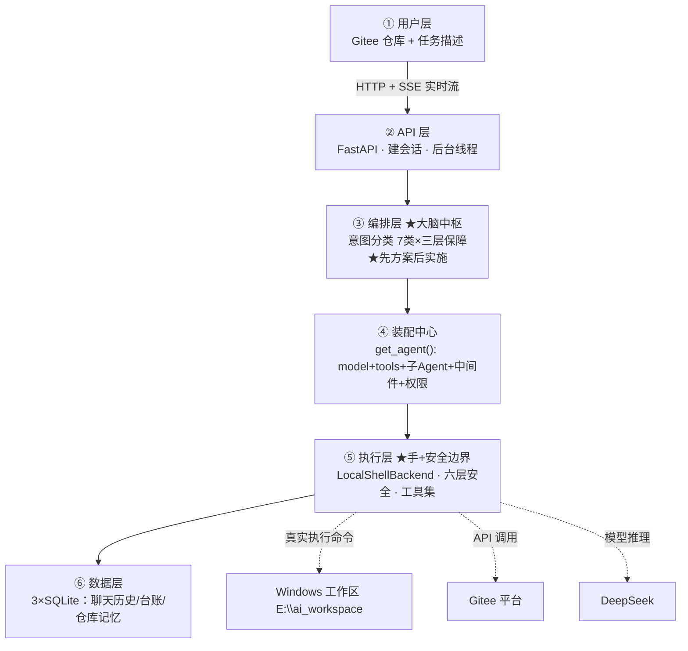

# AgentCoder · 简历包装方案

> 面向岗位方向：LLM / AI 应用 + 后端工程
> 本文件内容可直接复制到简历，也可作为面试准备材料。

---

## 一、项目命名

**主名：AgentCoder**
**中文名：基于大模型的智能编码 Agent 平台**
**英文名：LLM-Powered AI Coding Agent Platform**

**简历标题写法**：

> **AgentCoder · 基于大模型的智能编码 Agent 平台**

---

## 二、简历项目描述

### 高配版（推荐 · 写进简历）

**技术栈行**
> FastAPI · Uvicorn · DeepAgents · LangChain / LangGraph · DeepSeek（OpenAI 兼容）· SSE 实时流 · SQLite ×3 · Pydantic · asyncio / 多线程 · httpx · pytest

**项目简介**
> 一款让大语言模型以"AI 程序员"身份真实操作代码仓库的智能体平台：用户提交 Gitee 仓库地址与自然语言需求，Agent 自主完成需求理解、代码阅读、功能开发、测试验证、代码提交与 Pull Request 创建的全流程闭环。系统以"先方案后实施"的人机协作机制为核心，融合七类任务意图识别、六层安全纵深防御与三库分层存储，构建从请求到落库可追踪、可恢复、可实时观测的完整工程体系。

**核心亮点（7 条）**

1. **Agent 任务编排引擎**：构建 API → 编排 → 装配 → 执行 → 数据五层架构，以 `run_agent_task` 为调度中枢，支持直达分支 / 意图分类 / 方案确认 / coding 执行的多路径动态路由；实现"先方案后实施"确定性流程，通过 checkpoint 状态恢复与 `source_prompt` 还原，确保 Agent 在人类确认前绝不触碰代码。
2. **智能意图分类系统**：七类任务（coding / planning / analysis / qa / review / sync / inspect）经"关键词快速路 → `with_structured_output` 模型结构化分类 → 规则兜底"三层识别——低歧义任务不调模型省成本、模型分类失败自动回退规则、复杂任务结构化输出保准确。结果再过**只读安全阀**：检测到"只分析 / 不要改"等标记即强制降级任务类型，模型判成 coding 也无法突破用户只读边界。task_kind 最终驱动系统提示词、工具写权限与"先方案后实施"闸门，构成真正的运行时路由决策。
3. **实时流式观测架构**：基于 FastAPI + SSE 实现"边运行边推送"的实时反馈；以 `asyncio.Queue` + `call_soon_threadsafe` 完成工作线程→事件循环的线程安全桥接，将 DeepAgents v3 底层协议事件翻译为 text_delta / todo_delta / tool / subagent 结构化前端事件，含正文增量合并、文本块边界识别与独立 run_id 隔离。
4. **六层安全纵深防御**：token 脱敏（askpass 环境变量注入，token 不落命令字符串）、工作区虚拟路径隔离与防穿越、命令白名单（拦截 shell 操作符与危险命令）、只读目录约束、SSRF 防护（DNS pin + 内网 IP 黑名单）、任务资源上限（工具调用次数 / 时长），构建从"碰不到"到"跑不动"的完整防护链。
5. **三库分层存储架构**：设计 checkpoints（对话历史）/ store（业务台账）/ langgraph_store（仓库记忆）三套 SQLite 职责分离，确立"聊天正文唯一来源从 checkpoint 读取"的数据边界，规避双数据源重复 / 乱序 / 覆盖问题；任务后自动提炼仓库级长期记忆，实现跨会话知识复用。
6. **受控本地执行后端**：基于 DeepAgents BaseSandbox 实现 LocalShellBackend，将文件协议（ls / read / write / edit / glob / grep）与命令执行协议落地真实 Windows 工作区；虚拟路径隔离真实磁盘、Unix→Windows 命令适配、Gitee 非交互认证注入，为 Agent 划定"能读、能写、能执行"的明确边界。
7. **中间件管道与稳定性保障**：构建上下文注入、消息 / 参数清洗、错误恢复、运行限制等中间件管道；异常时统一关闭事件流、标记失败状态并 token 脱敏，保证前端永不卡在"运行中"。

> 面试时依面试官背景取舍：**AI 岗** 主打 1 / 2 / 5，**后端岗** 主打 3 / 4 / 6 / 7。

### 精简版（备用 · 简历空间紧张时用）

**技术栈行**
> FastAPI · DeepAgents · LangChain / LangGraph · DeepSeek · SQLite ×3 · SSE · Pydantic

**项目简介**
> 基于大模型的 AI 程序员平台：输入 Gitee 仓库地址与任务描述，Agent 自动完成代码克隆、阅读分析、功能开发、测试运行、代码提交与 Pull Request 创建；内置 7 类任务意图识别与"先方案后实施"的人机协作流程，通过六层安全防护保障真实环境下命令与文件操作的安全。

**核心亮点（6 条）**

1. **Agent 任务闭环**：基于 DeepAgents 框架搭建可真实执行命令/文件操作的 Coding Agent，工具化封装 Gitee API、联网搜索、网页抓取、代码审查，驱动 LLM 完成"克隆 → 阅读 → 修改 → 测试 → 提交 → 建 PR"全流程。
2. **人机协作机制**：设计"先方案后实施"流程——Agent 先读仓库输出技术方案，用户确认后才改代码；通过 checkpoint 存档还原原始需求（source_prompt），确保 AI 在人类确认前不动代码。
3. **任务意图分类**：将输入分为 coding / planning / analysis / qa / review / sync / inspect 七类，采用"关键词快速路 + 模型结构化分类 + 规则兜底"三层识别；结果再过只读安全阀，模型判成 coding 也会因"只分析"等标记强制降级，平衡准确率、模型成本与权限安全。
4. **后端实时流架构**：基于 FastAPI 构建 REST + SSE 接口，后台线程执行 Agent、主线程推送事件流，将模型输出增量、工具调用、子 Agent 进度实时翻译给前端，实现"边想边打"的反馈体验。
5. **六层安全防护**：token 脱敏、工作区路径白名单防越权、shell 命令白名单、只读目录约束、SSRF 防护（DNS pin + 内网 IP 黑名单）、任务资源上限（工具调用次数/时长）；异常时自动关闭事件流、会话标记 failed，保证前端不卡死。
6. **多级数据存储**：三套 SQLite 分层——checkpoints 存完整对话历史、store 存业务台账、langgraph_store 存仓库长期记忆，明确读写边界；任务后自动提炼技术栈/测试命令等写入仓库记忆，实现跨会话知识复用。

---

## 三、项目介绍

### 30 秒电梯演讲

> 这是一个让大语言模型像真人程序员一样操作真实代码仓库的项目。用户在网页上输入一个 Gitee 仓库地址和一段需求，Agent 会自动完成读代码、写代码、跑测试、提交、创建 PR 的全流程。我负责后端整体设计与实现，包括 Agent 装配、任务编排、工具调用、安全防护和 SSE 实时流。

### 90 秒面试完整版

> 这个项目是一个基于大模型的 AI 编码智能体平台。核心思路是让 LLM 真实地操作系统。
>
> 技术上，我基于 DeepAgents 框架和 LangChain 搭建 Agent，用 FastAPI 提供 HTTP 和 SSE 实时流接口，底层模型是 DeepSeek。数据层我设计了三个 SQLite 数据库各司其职：一个存完整对话历史，一个存业务台账，一个存仓库长期记忆，这样避免了数据源冲突。
>
> 我认为最有设计感的是三点。第一是**人机协作**：我们规定先方案后实施——Agent 收到开发需求后必须先读仓库输出一份技术方案，用户确认了才动手改代码。这里的关键是，用户说"确认"时系统不会把它当新需求，而是去存档里找回等待确认的方案，用里面保存的原始需求作为执行目标。第二是**意图分类**：把任务分成七类，用模型分类、安全规则修正、关键词兜底三层保障，既保准确率又省调用成本。第三是**安全设计**：因为要让 AI 真实执行命令，我从 token 脱敏、路径白名单、命令白名单、只读约束、SSRF 防护、资源上限六个维度做了防护，比如抓取网页时做 DNS pin 防止重绑定攻击。

---

## 四、面试注意事项（诚实包装）

- 这本质是**教学/个人项目**，面试被追问"为什么这样做"比"规模多大"更常见——主动说明"刻意做功能减法，方便讲清 Agent 原理"，反而显得有工程判断。
- **不要写**"上线支撑 X 万用户"之类的假数据；把亮点放在设计思路和落地细节上。
- 可能被追问的点要提前准备：
  - SSRF 防护原理（DNS pin、内网/回环 IP 黑名单）
  - SSE 与 WebSocket 的区别，为什么选 SSE
  - 为什么用三套 SQLite 而不是一套（聊天正文唯一来源从 checkpoint 读）
  - 意图分类的兜底逻辑（模型不可用时关键词分类）
  - "先方案后实施"如何从 checkpoint 还原 source_prompt
  - 子 Agent（general_purpose / code_reviewer）与主 Agent 的权限差异

---

## 五、项目事实速查（面试前过一遍）

| 项 | 事实 |
|---|---|
| 一句话 | 一个"AI 程序员"平台的后端，用于教学演示 |
| 底层模型 | DeepSeek（deepseek-v4-pro），走 OpenAI 兼容协议 |
| Agent 框架 | DeepAgents（create_deep_agent）、LangChain、LangGraph |
| Web 框架 | FastAPI + Uvicorn |
| 前端 | Vue/Vite（`ui/` 目录，不在本仓库） |
| 数据层 | 三套 SQLite：checkpoints（聊天历史）/ store（业务台账）/ langgraph_store（仓库记忆） |
| 任务类型 | 7 类：coding / planning / analysis / qa / review / sync / inspect |
| 执行后端 | LocalShellBackend：在本地 Windows 工作区真实执行命令/读写文件 |
| 安全 | 6 层：token 脱敏、路径白名单、命令白名单、只读约束、SSRF 防护、资源上限 |
| 记忆 | 任务后自动提炼技术栈/测试命令，写入 /memories/{owner}/{repo}.md |
| 已知坑 | prompt.py 第 22-30 行有乱码；有少量死代码（momory_update.py 等） |

---

## 六、面试介绍指南

### 1. 推荐框架：按这个顺序讲（约 2 分钟）

用「**是什么 → 我怎么做的 → 最有设计感的点 → 我的收获**」四步走，不要一上来背技术细节。

```
1. 一句话定位：让 LLM 像真人程序员一样操作真实代码仓库——给个仓库地址和需求，自动完成读代码、改代码、跑测试、建 PR。

2. 技术框架：FastAPI 接 HTTP + SSE 实时流，DeepAgents 拼装 Agent，DeepSeek 做底层模型，三套 SQLite 分层存数据。

3. 挑 2-3 个亮点展开（选你最熟的）：
   · 先方案后实施的"人机协作"机制
   · 七类任务意图识别的三层保障
   · 六层安全防护体系

4. 收尾：这个项目让我把"Agent 不只是聊天"这件事完整落地了，包括工具调用、状态持久化、真实环境的边界控制。
```

> 注意：第 3 步只挑你真正讲得透的讲，讲不透的留给面试官来问，反而显得有深度。

### 2. 分岗位侧重

| 面试官 | 开场侧重 | 主动带出来的点 |
|---|---|---|
| **AI/LLM 岗位** | 人机协作、意图分类、记忆系统 | "怎么让模型输出的 JSON 结构稳定"、"怎么复用跨会话知识" |
| **后端岗位** | SSE 实时流、SQLite 分层、中间件 | "为什么聊天正文只从 checkpoint 读"、"异常怎么保证前端不卡死" |
| **安全相关** | 六层防护 | "真实执行命令的最大风险是什么、怎么收敛" |
| **非技术/HR** | 一句话定位 + 项目带来的思考 | 讲清"AI 会真实改代码，所以要先确认方案" |

### 3. 高频追问 + 标准回答（背熟这些，能应对 80% 的深挖）

**Q: 为什么做「先方案后实施」？**
> 核心是防止 AI 乱改代码。最关键的实现是：用户说"确认"时，系统**不会把"确认"当新需求**，而是去 checkpoint 存档里找回最近一份等待确认的方案，用里面保存的原始需求（source_prompt）作为执行目标。这是写在流程代码里的硬约束，不是提示词软约束——所以模型再怎么发挥，也绕不过人这一环。

**Q: SSE 为什么不用 WebSocket？**
> 这是个单向推送场景，前端只收不推。SSE 基于 HTTP、自带断线重连，配合后台线程 + 事件队列就够用了。如果以后需要前端主动控制 Agent（比如暂停、注入指令），那才需要 WebSocket。选型是按当前需求定的。

**Q: 意图分类为什么是三层的？**
> 因为纯模型分类贵且不稳，纯关键词又不准。所以：简单任务（列项目、git pull）用关键词直接命中，不调模型省钱；复杂任务让模型输出结构化 JSON；**最后所有结果都过一道安全规则**——比如模型判成 coding，但用户说了"只分析"，就强制降级为只读。模型挂了还有关键词兜底，三层保证系统不裸奔。

**Q: 六层安全里，你觉得最关键的哪层？**
> 我选**命令白名单 + 路径白名单**这两层，因为它们是把"AI 能做什么"圈死的物理边界。shell 操作符（`&&`、`|`、`;`）全禁，只能在 `E:\ai_workspace` 工作区内读写，`..` 穿越直接报错。token 那层也很重要——Git 认证用 askpass 脚本注入环境变量，token 从不写进命令字符串，这样命令日志里不会泄密。

**Q: 为什么用三套 SQLite 而不是一套？**
> 关键原则是**聊天正文唯一来源从 checkpoint 读**，store 只存业务摘要。如果一套库又存正文又存台账，会出现两个数据源打架——重复、乱序、覆盖。三套各管各的：checkpoints 是聊天记录、store 是业务台账（会话状态、审查结果）、langgraph_store 是仓库记忆小抄。删除会话时两边一起删。

**Q: 仓库记忆是怎么做到跨会话复用的？**
> 任务结束后自动跑一个提炼逻辑（repo_memory_update.py），把技术栈、测试命令、最近结论写进 `/memories/{owner}/{repo}.md`。下次处理同一个仓库，Agent 装配时把这个文件作为上下文注入，就相当于员工上班先翻工作笔记，不用每次从零读仓库。

**Q: 这个项目看起来是教学项目，规模是不是比较小？**
> 对，它定位是教学演示，代码刻意做功能减法，方便讲清楚 Agent 原理。但我把关键机制——人机协作、意图分类、安全防护、分层存储——都做成了**真实的工程实现**，不是概念演示。如果你愿意，我可以现场讲一遍任意一条链路从请求到落库的完整数据流。

**Q: 有什么缺点？如果重做怎么改？**
> 诚实讲三个：一是硬编码了 Windows 工作区 `E:\ai_workspace`，跨平台跑不了，重做会做成配置化；二是 `prompt.py` 里有段中文乱码没修，虽然不影响主流程但不应该留着；三是测试覆盖不足。如果重做，我会把意图分类的规则抽成可配置的，再加一层端到端测试。

### 4. 三个坑，千万别踩

1. **不要夸大数据规模**。"支撑几万用户"这种话一戳就穿，而且这个项目根本不靠这个取胜。
2. **不要说"都是我一个人做的所以很小"**——改成强调"从架构设计到落地实现我完整负责"。
3. **被问到不会的，诚实说**。比如"LangGraph 底层状态机怎么实现的"——你可以说"这块我主要用框架能力，没深入源码，但我可以讲清楚我为什么选它"。

---

## 七、俯瞰视图（面试讲这张图）

> 这是整个项目的**面试讲解图**。面试时从上往下指着讲 60-90 秒，就能把全貌讲清楚。★ 标记的是"最有设计感、面试官最可能追问"的亮点，讲到那里稍微停一下，给对方提问空间。

### 1. 分层俯瞰图（可手绘 / 打印展示）

```
   ① 用户层
     网页输入：Gitee 仓库地址 + 一句任务描述
        │  HTTP + SSE 实时流（边想边打字的实时反馈）
        ▼
   ② API 层 (FastAPI / Uvicorn)
     dashboard_routes：建会话 → 启动后台线程执行 → 主线程 SSE 推事件
        │
        ▼
   ③ 编排层 runtime.py —— ★大脑中枢
     · 意图分类：7 类任务 × 三层保障（关键词命中 / 模型结构化 / 安全阀修正）
     · ★先方案后实施：无确认方案→转 planning 先输出方案；
                      有确认→从 checkpoint 还原 source_prompt 再执行
        │
        ▼
   ④ 装配中心 server.py get_agent()
     model + tools + 子Agent×2 + middleware×5 + 权限 + 技能 + 记忆 + checkpoint
        │
        ▼
   ⑤ 执行层 —— ★Agent 的"手" + ★六层安全边界
     LocalShellBackend：在真实 Windows 工作区执行命令 / 读写文件
     tools：Gitee API · 联网搜索 · 抓 URL · 代码审查
     subagents：general_purpose(只读) · code_reviewer(只读)
     ┌────────────┬──────────────┬───────────────┐
     ▼            ▼              ▼
  DeepSeek 模型   Gitee 平台    Windows 工作区(E:\ai_workspace)
        │
        ▼
   ⑥ 数据层（三套 SQLite）
     checkpoints.sqlite       聊天历史（正文唯一来源）
     store.sqlite             业务台账（会话 / 状态 / 审查结果）
     langgraph_store.sqlite   仓库记忆（跨会话复用"小抄"）
```

### 2. Mermaid 版（md 渲染 / 简历附件 / 博客用）



### 3. 60-90 秒讲图话术（照这个说）

> "我从上往下讲一下整个系统的俯瞰视图，一共六层。
>
> **最上面是用户层**：用户在网页上输入一个 Gitee 仓库地址，加一句任务描述，比如'给这个项目加一个部门管理模块'。
>
> **第二层 API 层**：FastAPI 收到请求后，先建一个会话记录，然后启动一个后台线程去跑 Agent，主线程通过 SSE 把结果实时推回前端——所以用户能看到 Agent '边想边打字'的反馈，而不是干等。
>
> **第三层是编排层，也是系统的大脑中枢**。它先做任务意图分类，我把任务分成七类，用三层保障：简单任务关键词直接命中、不调模型省钱；复杂任务让模型输出结构化 JSON；最后所有结果再过一道安全规则修正——比如模型判成 coding，但用户说了'只分析'，就强制降级为只读。分类之后进入**先方案后实施**：如果是开发类需求，Agent 不会马上改代码，而是先读仓库、输出一份技术方案，等用户确认。用户说'确认'时，系统去存档里还原原始需求再真正动手。
>
> **第四层是装配中心**：把一个 Agent 完整拼出来——模型、工具、子 Agent、中间件、权限、记忆、checkpoint 全在这层组装。
>
> **第五层是执行层，也是 Agent 的'手'**：LocalShellBackend 在真实的 Windows 工作区执行命令、读写文件。这里我把**安全边界**画在中间——因为让 AI 真实执行命令是有风险的，我从 token 脱敏、路径白名单、命令白名单、只读约束、SSRF 防护、资源上限六个维度做了防护。子 Agent 也在这层，它们只读、权限更小，防止被主 Agent 利用。
>
> **最下面是数据层**：三套 SQLite 各司其职——checkpoints 存完整聊天历史，store 存业务台账，langgraph_store 存仓库长期记忆，任务结束后自动提炼技术栈、测试命令写进仓库记忆，下次处理同一个仓库就不用从零读。
>
> 整个系统的核心思路一句话：**FastAPI 接请求，编排层决定这轮跑什么，Agent 用工具真实动手，安全边界兜底。**"

### 4. 讲图时的节奏提示

| 讲到哪 | 节奏 |
|---|---|
| ③ 编排层 · 意图分类 / 先方案后实施 | **放慢**，这是最亮的两点，讲完停 1-2 秒看对方反应 |
| ⑤ 执行层 · 六层安全 | 讲"命令白名单 + 路径白名单"两句即可，给追问留钩子 |
| ⑥ 数据层 · 三套 SQLite | 强调"聊天正文唯一来源从 checkpoint 读"，这是常见加分点 |
| 任何一层被追问 | 先接住问题，答完顺手指回图上的位置，保持"围着图讲" |

---

## 八、数据流详解（面试官追问细节时讲）

> 俯瞰视图讲"全貌"，这一章讲"一个请求到底怎么流到底"。面试官一旦往深里问，就按这一章的链路和数据边界答。所有细节都对照真实代码核实过。

### 1. 端到端时序：一次 coding 任务的完整旅程

```
浏览器
 │ POST /dashboard/api/threads/stream-message {content, repo}
 ▼
① dashboard_routes.py（API 层）
 ├─ _normalize_dashboard_repo_url()   规范化仓库地址（owner/repo 简写 → 完整 URL，非法返回 400）
 ├─ thread_id = uuid4()
 └─ _post_streaming_response()
     │ initialize_task_record() → store.upsert_thread(status="running") + record_event("created")
     │
     │ 按固定顺序 yield 首个 SSE 事件块：
     │  1. thread_snapshot    会话元信息（故意不带 messages，避免覆盖前端已有正文）
     │  2. user_message       用户真实输入回显（带稳定 message_id）
     │  3. message_start      创建 assistant 消息容器
     │  4. text_delta(append) "正在理解需求并准备仓库上下文..."
     │  5. 启动后台 worker 线程
     ▼
② worker 线程（后台，同步运行）
 └─ run_agent_task(repo_url, prompt, thread_id, event_sink)     ← runtime.py 大脑中枢
     ├─ 直达分支① 列工作区项目？   → run_workspace_listing_task，不调模型
     ├─ 直达分支② 仅 git pull？    → run_pull_only_task，不调模型
     ├─ classify_task_kind(prompt) → 粗粒度 task_kind（模型分类→安全阀→关键词兜底）
     ├─ 用户说"确认实施"？ → 从 checkpoint 反查最近待确认方案
     │     → coding_prompt = 方案 metadata.source_prompt，task_kind = "coding"
     ├─ 用户说"修改方案"？ → run_plan_response_task，仍以 planning 重新输出完整新版方案
     ├─ ★ task_kind=coding 且无已确认方案？ → 转入 planning（先方案后实施）
     │     此时 Agent 只读仓库、输出技术方案、等待用户确认，绝不改代码
     │
     ├─ 通用 Agent 执行分支：
     │    store.clear_run_events()
     │    record_event("created") → ("repo") → ("agent")
     │    run_id = uuid4(); store.record_run(status="running")
     │    agent = get_agent({configurable: {thread_id, task_kind, repo_url}})   ← server.py 装配
     │    run_agent_with_event_stream(agent, thread_id, run_id, content, task_kind, event_sink)
     │       └─ agent.stream_events(version="v3") 逐事件消费：
     │            · content-block-delta/text-delta → SSE text_delta(mode=replace) + run_events
     │            · write_todos 工具调用            → SSE todo_delta + run_events(kind=todo)
     │            · subagents 生命周期              → run_events(kind=think)
     │    store.finish_open_run_events("completed")
     │    store.update_thread_status("completed")
     │    store.record_run(status="completed", finished=True)
     │    update_repo_memory_from_text(...)  ← 把最终回答提炼写入仓库记忆
     ▼
 完成后 worker 发：thread_done(最新元信息) → done（结束 SSE）
 异常时 worker 发：error → thread_done → done（保证前端不卡在 running）
     ▼
③ event_iter 循环：从 asyncio.Queue 取事件 → 每个事件 yield 成标准 SSE 文本块 → 浏览器边收边渲染
```

### 2. SSE 线程桥接：为什么这么设计

- Agent 在**普通工作线程**里同步运行；SSE 响应在 **asyncio 事件循环**里异步发送。两者通过 `asyncio.Queue` 桥接。
- worker 线程不能直接 `await queue.put`，所以用 `loop.call_soon_threadsafe(queue.put_nowait, (event, payload))` 把事件**线程安全地投递回事件循环**，`event_iter` 负责消费并 yield 给浏览器。
- 事件 payload 会复制一份并统一补上 `thread_id`，避免跨会话串台。

### 3. text_delta 的两种 mode（容易被追问）

| mode | 场景 | 内容 |
|---|---|---|
| `append` | 启动提示 | "正在理解需求并准备仓库上下文..."，追加到启动消息 |
| `replace` | 流式正文 | 传的是**当前累计全文**（不是单 token 增量），前端整体替换，避免重复拼接 |

流式正文约每累计 **24 字符或遇换行**刷新一次，平衡"实时感"与"SQLite 写入频率"。

### 4. 「先方案后实施」的数据流转（核心考点，讲这个）

1. 用户首次提需求 → `task_kind` 被判为 coding，但**没有已确认的方案** → runtime 强制转入 planning。
2. planning 以**只读** Agent 运行，输出完整技术方案；方案正文进 **checkpoint**，同时把原始需求存进方案消息的 `metadata.source_prompt`。
3. 用户回复"确认" → `_is_approval_prompt()` 用**本地关键词规则**判断（故意不交给模型，因为是权限控制，不能赌模型）。
4. runtime 从 checkpoint **从后往前**反查最近一条"可确认方案"（`_is_confirmable_plan_text` 保守匹配"是否确认实施该方案/技术方案"等关键词，宁可漏判不可误判）。
5. `coding_prompt = metadata.source_prompt`（还原用户最初需求，而不是"确认"两个字）；`approved_plan` 把整份方案正文一起传给 Agent 作为实施依据。
6. 所以："确认实施"永远被执行成**上一轮方案**，而不是执行"确认"本身。

### 5. checkpoint 与 Store 的读写边界（高频追问）

| 数据 | 唯一来源 | 用途 |
|---|---|---|
| 聊天正文（user/assistant） | checkpoint | 前端实时展示 + 刷新后历史恢复 |
| 会话列表 / 状态 / 分支 / PR | Store | 左侧会话列表、任务状态 |
| 运行步骤 run_events | Store | 前端步骤区展示 |
| 审查发现 review_findings | Store | 审查报告 |
| 仓库记忆 | langgraph_store | 跨会话复用 |

- 前端**正文从不读 Store**——避免"两个数据源打架"（重复、乱序、覆盖）。
- 唯一两者同时参与的时机是**删除会话**：`store.delete_thread()` + `checkpointer.delete_thread()` 一起清。

### 6. 怎么保证前端历史不显示内部包装文本

- runtime 发给 Agent 的 HumanMessage 是包装过的：`用户可见输入：... 内部执行上下文：...Gitee 仓库地址：...任务类型：...用户任务：...`
- 前端历史恢复时，`_extract_user_prompt()` 优先提取"**用户可见输入：**"段，再按"用户任务：/原始用户需求："等标记剥离内部规则。
- 短过程消息（<200 字且不含"技术方案/审查报告/完成总结"等关键词）直接过滤，避免历史正文堆积无意义的"正在读文件"。
- checkpoint 的 seed+writes 可能重复返回同一条消息，按 `author + 压缩正文` 去重；稳定 id 用 `sha1(thread_id+author+content)`，保证刷新后前端不把旧消息当新消息。

### 7. 异常路径：为什么前端永远不会卡死

- worker 捕获所有异常 → 无论如何都推送 `error → thread_done → done`，done 是 SSE 终止事件。
- runtime 异常分支同时完成四件事：`finish_open_run_events("error")`、`update_thread_status("failed")`、`record_event("failed", mask_token(...))`、`record_run(status="failed", error=mask_token(...))`。
- 所有对外展示的异常都经过 `mask_token()` 脱敏，token 不会出现在页面或日志。

### 8. 三套 SQLite 写入时机速查

| 库 | 表 | 写入时机 |
|---|---|---|
| checkpoints.sqlite | LangGraph checkpoint | 每轮对话/工具调用由 checkpointer 自动落盘 |
| store.sqlite | threads | `initialize_task_record` / `run_agent_task` 的 `upsert_thread` |
| store.sqlite | runs | 每轮执行 `record_run`（running → completed / failed） |
| store.sqlite | run_events | `record_event`（created / repo / agent / model / done / failed） |
| store.sqlite | review_findings | 代码审查工具写入 |
| langgraph_store.sqlite | `/memories/{owner}/{repo}.md` | 任务初始化时 `ensure_repo_memory_initialized`；成功后 `update_repo_memory_from_text` |
