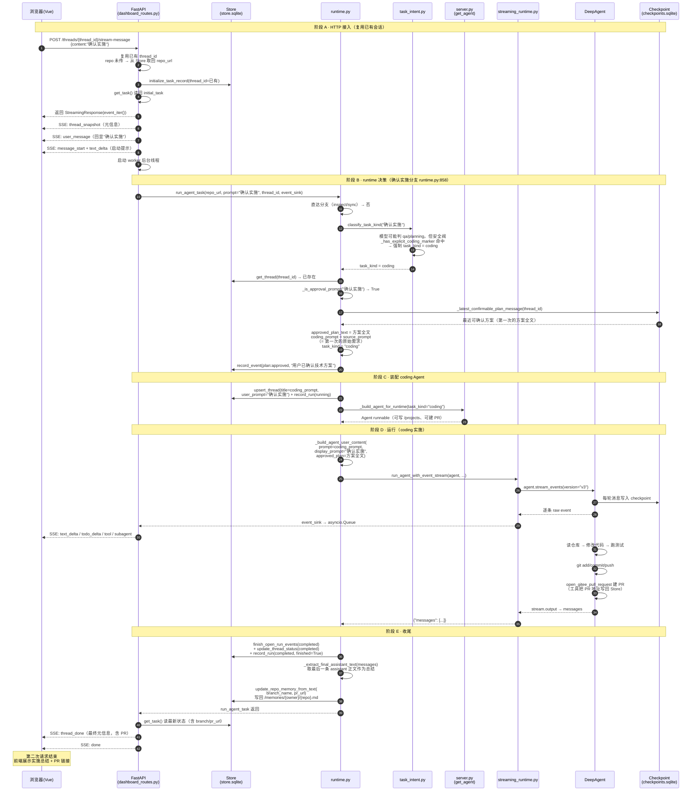

# 用户第二次请求（确认实施）的完整时序图

> 本文档画「**用户第二次请求：确认实施**」从头到尾的完整时序图。
> 场景：第一次请求已经输出过一份技术方案（存在 checkpoint），用户现在回复"确认实施"，
> runtime 从 checkpoint 反查方案、还原原始需求，**真正进入 coding 流程**：改代码 → 测试 → 提交 → push → 建 PR。
>
> **核心结论先放这**：第二次请求和第一次的本质区别是——第一次被核心闸门**强制转 planning**；
> 第二次因为 `_is_approval_prompt("确认实施")` 命中，并能在 checkpoint 找到可确认方案，
> 才会带着 `approved_plan` 真正进入 coding。**"确认"两个字本身不会作为需求，真正执行的是第一次的原始需求。**

---

## 场景前提

| 项 | 值 |
|---|---|
| 会话 | 复用已有 `thread_id`（第一次请求已存在） |
| 用户输入 | `"确认实施"`（或"开始实施 / 按方案实施"等） |
| checkpoint | 已有第一次生成的完整技术方案（awaiting_confirmation） |
| 意图分类 | 模型可能判 qa/planning，但**安全阀强制修正为 coding** |
| 实际走向 | checkpoint 反查方案 → source_prompt 还原需求 → **coding（实施）** |

---

## 完整时序图（一次请求，从头到尾）

---

## 这张图的关键点

1. **"确认实施"如何被识别为 coding**（`task_intent.py:205`）：`_has_explicit_coding_marker` 显式包含"确认实施/确定实施/开始实施/按方案实施/执行方案"等词。即使模型把"确认实施"误判成 qa/planning，安全阀也会强制修正回 coding。

2. **"确认"两个字不会作为需求**（`runtime.py:867-870`）：`coding_prompt = source_prompt`——从 checkpoint 里方案消息的 metadata 取出第一次的原始需求；没有 metadata 时回退 `_latest_non_approval_user_prompt` 找最近一条非确认类用户消息。**Agent 执行的是原始需求，不是"确认实施"。**

3. **display_prompt 与 coding_prompt 分离**（`runtime.py:854-856`）：`display_prompt` 是本轮真实输入（"确认实施"，用于前端展示），`coding_prompt` 是执行目标（原始需求）。Store 的 `user_prompt` 只存 `display_prompt`（`runtime.py:918`），避免前端收到上一轮需求文本造成误判重复。

4. **approved_plan 全文注入**（`runtime.py:209-211`）：`_build_agent_user_content` 把已确认方案作为"用户已经确认以下技术方案，请按该方案实施"注入，Agent 严格按方案实施。

5. **收尾会写仓库记忆**：与第一次（方案一般不写记忆）不同，第二次任务完成后 `update_repo_memory_from_text` 会把技术栈、测试命令、结论、分支、PR 地址写回 `/memories/{owner}/{repo}.md`（`runtime.py:963-972`）。

6. **没有可确认方案时的防御**（`runtime.py:887-889`）：用户说"确认"但 checkpoint 里找不到可确认方案 → 把"确认"当普通问题重新分类，**绝不误执行旧任务**。

---

## 第一次 vs 第二次（衔接关系）

| 环节 | 第一次请求 | 第二次请求（确认实施） |
|---|---|---|
| thread_id | 新生成 | 复用现有 |
| 输入 | 原始需求 | "确认实施" |
| 意图分类 | 模型判 coding → 被闸门改 planning | 安全阀强制 coding |
| checkpoint | 输出方案（awaiting_confirmation） | 反查方案 + source_prompt |
| Agent 任务 | 只读，输出方案 | 改代码/测试/提交/push/建 PR |
| 权限 | 只读（不能写/不能建 PR） | 可写 /projects，可 open_gitee_pull_request |
| 仓库记忆 | 一般不写 | 写回技术栈/结论/分支/PR |
| 结束状态 | 方案待确认 | completed（含 PR） |

> 两文衔接：首次见 [FIRST_REQUEST_FLOW.md](./FIRST_REQUEST_FLOW.md)，本条链路见 [REQUEST_FLOW.md](./REQUEST_FLOW.md)。

---

*本文档为 REQUEST_FLOW.md 的"第二次请求（确认实施）"专题版，与 FIRST_REQUEST_FLOW.md 互补。*
