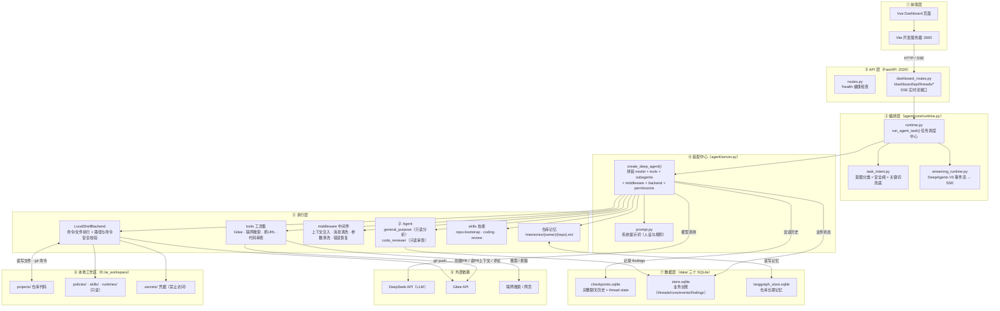
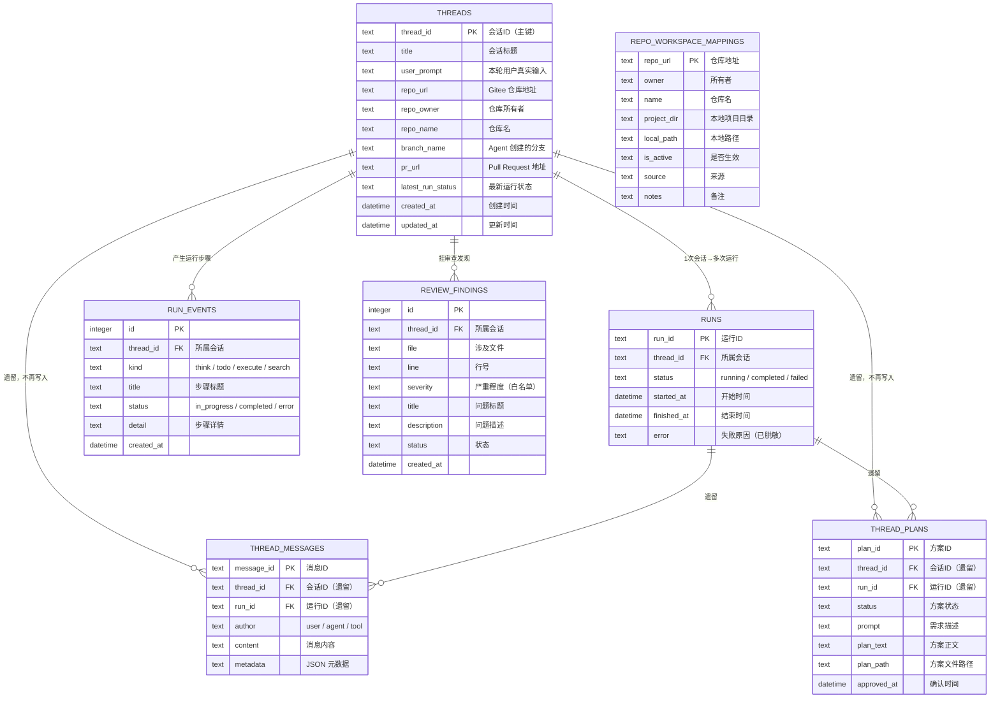
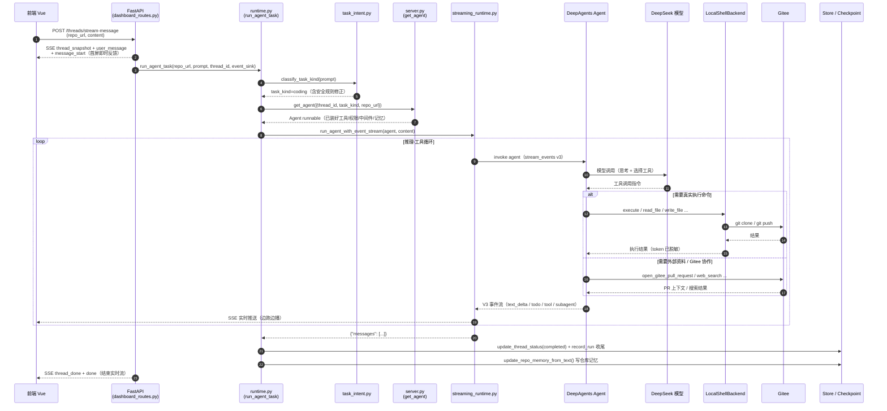
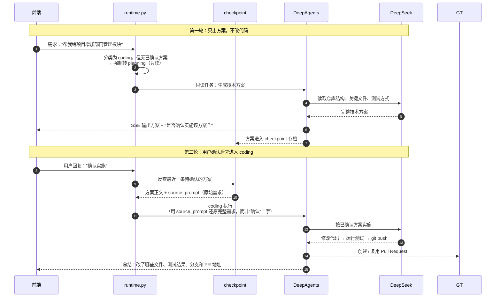

# LX-AICODING 系统架构图

> 本文件用 Mermaid 描述整个系统的高层架构与请求时序。在 GitHub / GitLab / VS Code / Typora 等支持 Mermaid 的渲染器中可直接查看。
>
> 一句话架构：**Vue 前端 → FastAPI → 编排层决定"这轮跑什么" → server.py 拼装 DeepAgents → Agent 驱动 DeepSeek 调用工具 → LocalShellBackend 在本地 Windows 工作区真实执行 → 状态与历史落 SQLite。**

> **📚 配套文档**：想看"这个项目是干什么的" → [PROJECT_ANALYSIS.md](./PROJECT_ANALYSIS.md)；想知道"从哪里开始看" → [ONBOARDING_GUIDE.md](./ONBOARDING_GUIDE.md)；面试前 → [INTERVIEW_GUIDE.md](./INTERVIEW_GUIDE.md)。

---

## 系统架构总览



---

## 各层职责速查

| 层 | 代码位置 | 职责 | 关键约束 |
|---|---|---|---|
| ① 前端 | `ui/`（不在本仓库） | 展示会话、输入任务、实时渲染 SSE 流 | 只发 HTTP/SSE，不接触数据库 |
| ② API 层 | `agent/api/` | 接收 HTTP 请求、管理会话、返回 SSE 实时流 | 只做适配，不含业务逻辑 |
| ③ 编排层 | `agent/core/runtime.py` | 决定任务走哪条流程（sync/inspect/planning/coding…）、维护"先方案后实施"、状态落库 | **coding 必须先有已确认方案** |
| ④ 装配中心 | `agent/server.py` | 用 DeepAgents 把 Agent 拼装出来 | 按 thread 缓存 backend，复用工作区 |
| ⑤ 执行层 | `agent/backends/` `agent/tools/` `agent/core/middleware/` | 真实执行命令/文件、提供工具能力、清洗与保护 | 命令白名单 + 路径边界 + token 脱敏 |
| ⑥ 工作区 | `E:/ai_workspace` | 仓库代码、技能、策略、凭据存放地 | `.secrets/`、`policies/` 等只读 |
| ⑦ 数据层 | `data/*.sqlite` | 聊天历史（checkpoint）、业务台账（store）、仓库记忆（langgraph store） | 聊天正文**只从 checkpoint 读** |
| ⑧ 外部依赖 | — | DeepSeek 推理、Gitee 托管/PR、联网资料 | 全部走工具或 backend，模型不直连 |

---

## 数据库表关系（erDiagram）

> 本项目三套 SQLite 中，**只有 `data/store.sqlite`（业务台账）是项目自己设计表结构**，实体关系如下。
> `checkpoints.sqlite`（聊天历史）和 `langgraph_store.sqlite`（仓库记忆）的表由 LangGraph 框架自动创建管理，不在此图中展开。
>
> 用颜色区分：**实线 = 当前在用**，虚线标注的表 = 历史遗留（结构仍在但新链路不再写入）。



> 补充说明：
> - `REPO_WORKSPACE_MAPPINGS`（仓库目录映射表）**整表遗留**：现在本地目录统一由 `repo_project_dir()` 固定推导为 `projects/<repo>`，不再查这张表。
> - `SETTINGS`（key/value 配置表）是独立配置表，与业务表无关联，未在图中连线。

---

## 请求时序图

### 时序图 1：一次 coding 请求的完整调用链

展示从用户发起请求到任务完成的全部交互，包括 SSE 实时事件流和"推理 → 调工具"的循环。



### 时序图 2：先方案、后实施（本项目核心人机流程）

coding 任务默认不会直接改代码：第一轮只出方案，用户确认后才进入实施。这个时序体现 runtime 如何保证"人类确认后 Agent 才动代码"。



> 关键保障：如果用户回复"确认"但 checkpoint 里找不到可确认的方案，runtime 会把它当普通问题处理，**绝不**误执行旧任务。

---

## 关键调用链（一次 coding 任务）

```
前端 POST /threads/stream-message
  → dashboard_routes 建会话、发 SSE 首屏事件、起后台线程
  → runtime.run_agent_task()
      → 意图分类（直达分支 / 模型分类 / 安全阀）
      → 没有已确认方案 → 转 planning 输出方案
      → 用户确认 → 从 checkpoint 找回方案 → 进入 coding
  → server.get_agent() 拼装 Agent
  → DeepAgents 驱动 DeepSeek 推理 + 调用工具
  → LocalShellBackend 在 Windows 上真实执行（改代码/测试/git）
  → 收尾：更新 Store 状态 + 自动写仓库记忆
```

---

## 安全边界一览

| 防护 | 位置 | 作用 |
|---|---|---|
| Token 脱敏 | `tools/gitee_api.mask_token` | 全链路把 Gitee Token 替换为 `***` |
| 路径边界 | `backends/workspace.py` + `local_shell.py` | 文件操作必须落在工作区内，拒绝 `..` 穿越 |
| 命令白名单 | `backends/permissions.py` | 只允许 python/git/pytest 等，拒绝 shell 操作符 |
| 目录只读 | `local_shell._write_deny_reason` | `.secrets`、`policies/`、`skills/` 等不可写 |
| 业务只读 | `task_intent.is_read_only_task` | 只读任务中创建 PR 工具直接拒绝 |
| SSRF 防护 | `tools/safe_http.py` | DNS pin + 内网/回环 IP 黑名单 |
| 运行限额 | `core/middleware/run_limits.py` | 按任务类型限制工具调用次数与时长 |

---

*本文件为系统架构说明，与 `PROJECT_ANALYSIS.md`（完整项目理解指南）配套使用。*
