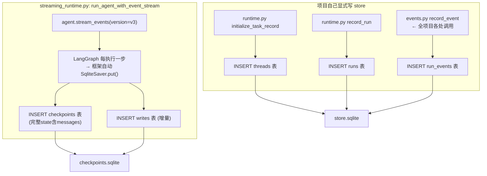
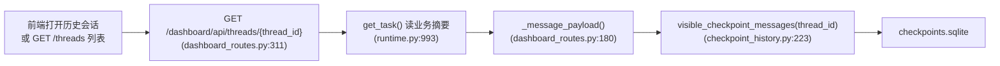
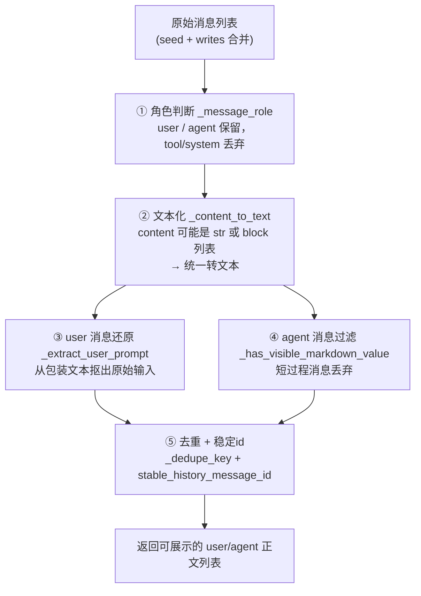

# 会话聊天记录恢复链路

> 本文档讲透"根据 `thread_id` 恢复一个会话的聊天记录"是怎么实现的。
> 核心不是简单查数据库，而是从 LangGraph checkpoint 还原出前端能展示的干净正文，中间要过 **5 道加工**。
>
> 核心代码：`agent/core/checkpoint_history.py`（正文还原）· `agent/api/dashboard_routes.py`（API）· `agent/core/runtime.py`（业务摘要）

---

## 目录

- [一、一句话定位](#一一句话定位)
- [二、存入是怎么发生的](#二存入是怎么发生的)
- [三、触发链路（前端怎么发起）](#三触发链路前端怎么发起)
- [四、核心读取：seed + writes（LangGraph delta channel）](#四核心读取seed--writeslanggraph-delta-channel)
- [五、5 道加工：从原始消息到前端正文](#五5-道加工从原始消息到前端正文)
- [六、恢复出来的样子（返回格式）](#六恢复出来的样子返回格式)
- [七、一个具体例子](#七一个具体例子)
- [八、记忆锚点](#八记忆锚点)

---

## 一、一句话定位

> **恢复 = 前端按 `thread_id` 调接口 → `checkpoint_history` 用 `get_delta_channel_history` 读 LangGraph checkpoint（seed + writes）→ 5 道加工还原成干净的 user/agent 正文。** 前端聊天正文只从 checkpoint 读，`store.sqlite` 只提供会话摘要。

**数据源约定**（整个项目的关键原则）：
- 聊天正文（唯一权威）→ `checkpoints.sqlite`
- 业务摘要（标题/状态/PR/findings）→ `store.sqlite`
- 两者用同一个 `thread_id` 关联

---

## 二、存入是怎么发生的

先讲"怎么存"再讲"怎么恢复"，两个方向对称。

**核心结论**：聊天正文的"存入"**不是项目代码 INSERT 的**——是 LangGraph 框架在 Agent 每执行一步时自动写的。项目只做一件事：把 checkpointer 接到 Agent 上，然后模型/工具的每轮消息就被框架自动存进 `checkpoints` 表了。项目自己显式 INSERT 的，只有 `store.sqlite` 的业务摘要。

### 聊天正文（checkpoint）怎么存进去

**项目侧的接入点（只有 3 处，都不 INSERT）**：

| 代码位置 | 干什么 |
|---|---|
| `server.py:463` `checkpointer=get_checkpointer()` | 把 checkpointer 传给 `create_deep_agent`，让 Agent 运行图"带存档" |
| `graph.py:28` `get_checkpointer()` | 返回 `SqliteSaver`（连 `checkpoints.sqlite`） |
| `streaming_runtime.py:725` | `agent.stream_events(..., config={"configurable": {"thread_id": thread_id}})` —— 运行时带上 thread_id |

**真正的 INSERT 在 langgraph 库内部（`SqliteSaver.put`）**：每次图执行一步，LangGraph 自动调 `put()`：

```python
cur.execute(
    "INSERT OR REPLACE INTO checkpoints "
    "(thread_id, checkpoint_ns, checkpoint_id, parent_checkpoint_id, type, checkpoint, metadata) "
    "VALUES (?, ?, ?, ?, ?, ?, ?)",
    (str(config["configurable"]["thread_id"]), checkpoint_ns,
     checkpoint["id"], config["configurable"].get("checkpoint_id"),
     type_, serialized_checkpoint, serialized_metadata),
)
```

- **`checkpoint` 字段** = 序列化后的**完整 state**（内含 `messages` channel——所有聊天正文）；
- 每轮的**增量**另写 `writes` 表（`put_writes`）；
- 一条 checkpoint 一条 `checkpoint_id`，用 `parent_checkpoint_id` 串成历史链；
- 存的是"整图状态快照"不是单条消息——所以恢复时要读 delta channel（seed + writes）。

> 项目里搜"INSERT INTO checkpoints"是搜不到的——它藏在 langgraph 库的 `SqliteSaver.put()` 里，由框架在你 `stream_events` 运行时自动触发。

### 业务摘要（store.sqlite）的写入 —— 项目自己 INSERT

| 表 | 项目调用点 | 实际 INSERT 位置（`sqlite_store.py`） |
|---|---|---|
| `threads` | `runtime.py:507` `initialize_task_record`；`:912` `upsert_thread` | `upsert_thread` `:208` |
| `runs` | `runtime.py:926` `record_run` | `record_run` `:288` |
| `run_events` | `events.py:24` `record_event`（全项目到处调） | `add_run_event` `:319` |
| `review_findings` | `reviewer_tools.py` 的 `add_review_finding` | `add_finding` `:605` |
| `settings` | `set_setting` | `:633` |

例如 `run_events` 的真实 INSERT（`sqlite_store.py:319`）：

```python
self._conn.execute(
    """
    INSERT INTO run_events (
      id, thread_id, kind, title, status, detail, created_at, updated_at
    ) VALUES (?, ?, ?, ?, ?, ?, ?, ?)
    ON CONFLICT(id) DO UPDATE SET ...
    """,
    (event_id, thread_id, kind, title, status, detail, now, now),
)
```

### 一次 Agent 运行，什么时候写哪些表



**时间线**（一次请求）：
1. 任务开始 → `initialize_task_record` 写 `threads`（running）
2. Agent 跑起来 → 框架每步自动写 `checkpoints` / `writes`（聊天正文，你无感）
3. 过程中 `record_event` 写 `run_events`（前端步骤）
4. 结束 → `update_thread_status` 改 `threads` 状态 + `record_run` 收尾 `runs`

---

## 三、触发链路（前端怎么发起）



`thread_id` 是一路传下去的钥匙：API → runtime → `checkpoint_history` → `SqliteSaver`。

前端还可能通过 `GET /dashboard/api/threads?limit=50`（列表）一次性拿到多个会话，每个会话的 `messages` 同样来自 `visible_checkpoint_messages`（`dashboard_routes.py:308`）。

---

## 四、核心读取：seed + writes（LangGraph delta channel）

第一步不是 `SELECT * FROM messages`，而是用 LangGraph 的方式读 **channel 历史**（`checkpoint_history.py:40`）：

```python
config = {"configurable": {"thread_id": thread_id}}
history = checkpointer.get_delta_channel_history(config=config, channels=["messages"])
```

**为什么用 delta channel 而不是 `get_tuple()` 快照**：新版 DeepAgents/LangGraph 把历史存在 delta channel 里（seed + writes），直接取快照拿不到完整消息（`checkpoint_history.py:42-49` 注释）。

**seed + writes 是什么**：

| 部分 | 是什么 |
|---|---|
| `seed` | 基础快照（图第一次运行时的初始消息） |
| `writes` | 之后每次图运行的**增量写入**（每轮新增的消息） |

```python
seed_value = getattr(seed, "value", None)     # 基础消息
for write in writes:                          # 每条增量
    messages.extend(write[2])                 # write[2] 是消息列表
```

> 注意：seed 和 writes 可能重复返回同一条消息、带不同消息 id——这正是后面第 ⑤ 道加工（去重）存在的原因。

---

## 五、5 道加工：从原始消息到前端正文

读出来的是 LangChain 消息对象，还不能直接给前端。`visible_checkpoint_messages`（`:223`）过 5 层：



### ① 角色判断（`_message_role`，`:174`）

`HumanMessage → user`，`AIMessage → agent`，其它（tool/system）丢弃。历史只留 user 和 agent 两方对话。

### ② 文本化（`_content_to_text`，`:15`）

DeepSeek 兼容接口可能返回 content block 列表（`[{"type":"text","text":"..."}]`），要统一抽成字符串。

### ③ 用户输入还原（`_extract_user_prompt`，`:83`）——最容易漏的一层

后端发给模型的用户内容**不是原始输入**，而是被包装过的：

```text
用户可见输入：
帮我加个部门模块        ← 原始输入

内部执行上下文：
Gitee 仓库地址：...
任务类型：coding
用户任务：...
```

`_extract_user_prompt` 做两件事：
- **优先读"用户可见输入："**（`:99-110`），从包装文本里抠出用户真正敲的那句话——否则前端会显示一大坨内部包装内容；
- 方案修订场景还要处理"用户新的修改要求："（`:115-129`）。

### ④ agent 正文过滤（`_has_visible_markdown_value`，`:151`）

Agent 会产生很多短过程消息（"现在读取文件"）。规则：`len < 200` 且没有 `技术方案/审查报告/完成总结/整体架构` 等标记的直接丢弃，避免历史里堆满碎话。

### ⑤ 去重 + 稳定 id（`:190, :211`）

- **去重键 = author + 压缩后的 content**（`_dedupe_key`）——不是消息对象 id，因为 seed 和 writes 可能重复返回同一条消息；
- **稳定 id = sha1(thread_id + author + content)**（`stable_history_message_id`）——旧实现用列表 index 当 id，新增消息后 index 会变、前端误判；改成内容哈希后，同一条正文在多次刷新中保持同一个 id。

---

## 六、恢复出来的样子（返回格式）

最终前端拿到的是一整个 JSON 会话对象，其中 `messages` 数组就是恢复出来的聊天记录。

### 单条消息格式（`_message_payload` 组装，`dashboard_routes.py:180`）

```json
{
  "id": "0c8a3f1e-...-history-user-8f3a2b1c9d0e4f5a",
  "author": "user",
  "timestamp": "2026-08-25T08:00:00.000000+00:00",
  "chunks": [
    { "kind": "text", "text": "帮我加个部门模块" }
  ]
}
```

| 字段 | 来源 | 值 |
|---|---|---|
| `id` | `stable_history_message_id` 生成的稳定 id | `{thread_id}-history-{author}-{sha1前16位}` |
| `author` | checkpoint 里的角色 | `"user"` 或 `"agent"` |
| `timestamp` | 消息创建时间（没有则用 thread 的 created_at 兜底） | ISO 时间 |
| `chunks[0].text` | 经过 5 道加工后的**干净正文** | 用户原始输入 / agent 完整回答 |

### 完整 messages 数组（4 轮对话的例子）

```json
"messages": [
  {
    "id": "0c8a...-history-user-8f3a2b1c...",
    "author": "user",
    "timestamp": "2026-08-25T08:00:00.000000+00:00",
    "chunks": [{ "kind": "text", "text": "帮我加个部门模块" }]
  },
  {
    "id": "0c8a...-history-agent-d91e4f5a...",
    "author": "agent",
    "timestamp": "2026-08-25T08:01:30.000000+00:00",
    "chunks": [{ "kind": "text", "text": "## 技术方案\n\n### 需求理解\n..." }]
  },
  {
    "id": "0c8a...-history-user-2b7c9d10...",
    "author": "user",
    "timestamp": "2026-08-25T08:02:00.000000+00:00",
    "chunks": [{ "kind": "text", "text": "确认实施" }]
  },
  {
    "id": "0c8a...-history-agent-5a1e6f2b...",
    "author": "agent",
    "timestamp": "2026-08-25T08:05:00.000000+00:00",
    "chunks": [{ "kind": "text", "text": "## 任务完成总结\n\n已新增 Department 模块..." }]
  }
]
```

**注意**：
- 每条 `text` 都是**加工后**的干净正文（user 抠掉了内部包装、agent 过滤了短过程消息），不是 checkpoint 里的原始包装消息。
- 中间若有"正在读取文件"这类短 agent 消息，已被过滤，不出现。
- `id` 是稳定的（内容哈希），前端刷新不会变。

### 整个会话对象（`_thread_payload` 完整返回，`dashboard_routes.py:212`）

```json
{
  "id": "0c8a3f1e-7b2d-4c5e-9a1f-0e2d3c4b5a6f",
  "title": "帮我加个部门模块",
  "repo": "msb-goldbin/ai_coding",
  "repoFullName": "msb-goldbin/ai_coding",
  "branch": "feat-department",
  "model": "deepseek-v4-pro",
  "effort": null,
  "source": "dashboard",
  "status": "finished",
  "createdAt": 1756099200000,
  "updatedAt": 1756100400000,
  "messages": [ ...上面那 4 条... ],
  "pr": {
    "number": 12,
    "title": "LX-AICODING Pull Request",
    "state": "open",
    "headRef": "feat-department",
    "baseRef": "master",
    "url": "https://gitee.com/msb-goldbin/ai_coding/pulls/12"
  },
  "latestPlan": null,
  "diffStats": null,
  "changedFiles": []
}
```

| 字段 | 从哪来 |
|---|---|
| `id / title / repo / branch / status` | **store.sqlite** 的 threads 表（`get_task` 读的） |
| `createdAt / updatedAt` | store 的时间转毫秒（`_timestamp_ms`） |
| `messages` | **checkpoints.sqlite**（恢复链路） |
| `pr` | store 里的 pr_url 组装（`_pr_payload`） |
| `model` | `.env` 的 `MAIN_MODEL` |
| `latestPlan / diffStats / changedFiles` | 当前课程版没接，固定 null/[] |

---

## 七、一个具体例子

假设会话有 4 轮：
1. 用户："帮我加部门模块"（被包装成含内部上下文的消息）
2. Agent 输出技术方案（长 Markdown）
3. 用户："确认实施"
4. Agent 输出实施总结（长 Markdown）

恢复时的处理：

| 原始消息 | 经过加工后前端看到 |
|---|---|
| user（包装了内部上下文） | **"帮我加部门模块"**（③ 还原） |
| agent（技术方案，长文） | 完整方案（④ 保留，因含"技术方案"标记） |
| user（包装了内部上下文） | **"确认实施"**（③ 还原） |
| agent（实施总结，长文） | 完整总结（④ 保留） |
| agent（"现在读取文件"等短消息） | **丢弃**（④ 过滤） |

最终前端显示 4 条干净气泡：你问 → 方案 → 确认 → 总结。

---

## 八、记忆锚点

> **恢复 = `thread_id` 一路传到底 → `get_delta_channel_history` 读 seed + writes → 5 道加工（角色 / 文本化 / 还原用户输入 / 过滤短消息 / 去重 + 稳定 id）→ 干净正文。**
> 聊天正文只在 checkpoint，store 只存摘要；删除会话时两边一起删（`runtime.py:1026`）。

---

*本文档由分析项目代码整理，用于理解会话聊天记录的恢复链路。*
